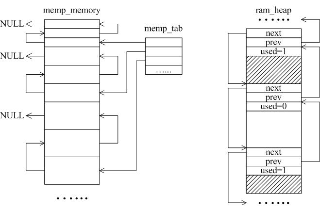
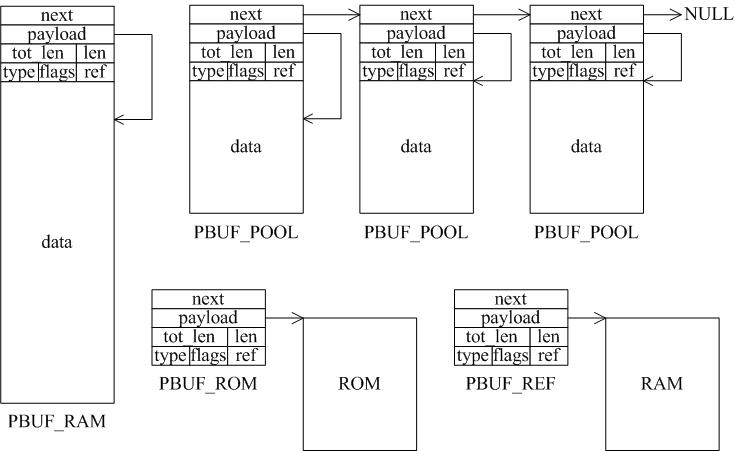
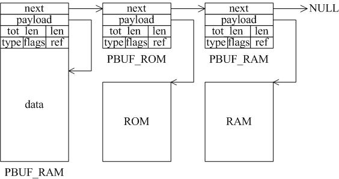

# LWIP内存管理
LWIP常用的两种内存分配策略：内存堆分配memp和内存池分配mem  
内存池|内存堆
---|-------
预先开辟多组固定大小的内存块组织成链表|对事先定义好的内存块进行合理有效的组织和管理
实现简单|实现复杂
分配和回收速度快|分配需要查找、回收需要合并
不会产生内存碎片|易产生内存碎片
大小固定且需预估算准确|主要用于任意大小的内存分配，需要合理估算内存堆的大小 
  
## 数据包管理
类别|分配方式|特点|使用场合
--|--|--|--|--
PBUF_RAM |内存堆，包括pbuf和数据区|长度不定，分配耗时 |应用程序和协议栈
PBUF_POOL| 内存池，包括pbuf和数据区|长度固定，分配快 |中断服务程序
PBUF_ROM |内存池，仅包括pbuf |所指数据位于ROM中| 应用程序引用内存区
PBUF_REF| 内存池，仅包括pbuf |所指数据位于RAM中| 应用程序引用内存区

只有选择合适的pbuf类型才能发挥LWIP的最大性能，一个数据包可能是多种pbuf的组合，用链表连接起来 

