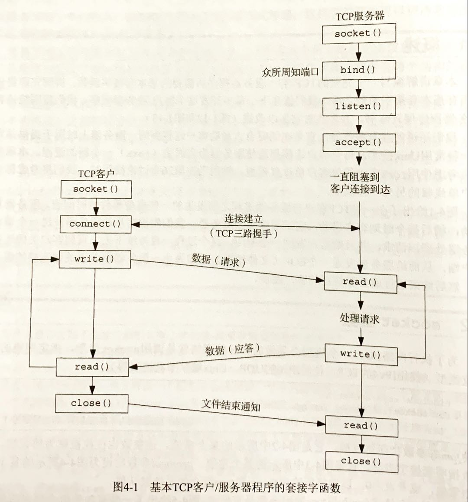
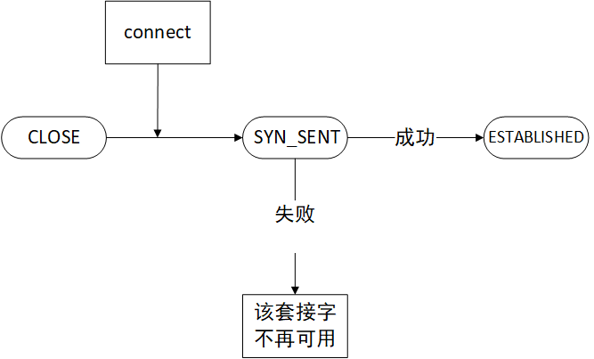

# Unix网络编程卷1


## 第3章 套接字编程简介

### 数据类型

| 数据类型    | 说明                                 |
| ----------- | ------------------------------------ |
| sa_family_t | 套接字地址结构的地址族               |
| socklen_t   | 套接字地址结构的长度，一般为uint32_t |
| in_addr_t   | IPv4地址，一般为uint32_t             |
| in_port_t   | TCP或UDP端口，一般为uint16_t         |

### 字节排序函数

大端和小端的区别

**网络字节序**：大端

函数：

```c
uint16_t htons(uint16_t)
uint32_t htonl(uint32_t)
uint16_t ntohs(uint16_t)
uint32_t ntohs(uint32_t)
```

### 字节操纵函数

``` c
bzero(void*, size_t)   //归零
bcopy(const void*src, void *dest,size_t nbytes)  //复制
bcmp(const void*, const void*, size_t)  //比较
memset（void*, int,size_t)       //归零
memcpy(void*,const void*,size_t)    //复制
memcmp(const void*,const void*,size_t) 		//比较
```

### 地址转换函数

| 函数                                                   | 返回                                                      | 说明                                                         |
| ------------------------------------------------------ | --------------------------------------------------------- | ------------------------------------------------------------ |
| `int inet_aton(const char*, struct in_addr*)`          | 1：有效                                                   | 将c字符串转换成一个32位的网络字节序二进制                    |
| `in_addr_t inet_addr(const char*)`                     | 有效：32未二进制网络字节序的IPv4地址<br />无效：INADDR_NO | ==已废弃==。 与 `inet_aton` 作用相同,不能处理有限广播地址`255.255.255.255` |
| `char* inet_ntoa(sturct in_addr)`                      | 指向一个点分十进制数串的指针                              | 将32位的网络字节序二进制IPv4转换为相应的点分十进制数串       |
| `int inet_pton(int,const char*, void*)`                | 成功：1     输入不是有效格式：0              出错：-1     | 字符串转换，字符串->二进制                                   |
| `const char* inet_ntop(int,const void*, char*, size)t` | 成功：指向结果的指针    出错：NULL                        | 字符串转换，二进制->字符串                                   |

*p：表达(presentation)|字符串  n：数值（numeric）|二进制*

errno取值：EINTR

说明 系统调用被一个捕获的信号中断

## 第4章 基本套接字编程



### 基本套接字函数

| 函数                                                         | 说明                                                         |
| :----------------------------------------------------------- | ------------------------------------------------------------ |
| `socket(int family, int type, int protocol)`                 | 指定期望的通信协议类型，成功则返回套接字描述符（sockfd）     |
| `connect(int sockfd, const struct sockaddr* servaddr, socklen_t addrlen)` | 与服务器建立连接，connect失败则该套接字不再可用，需要close后再socket |
| `bind(int sockfd, const struct sockaddr* myaddr,socklen_t addrlen)` | 把一个本地协议地址赋予一个套接字。未调用bind时，使用connect或listen，内核将为相应套接字分配临时端口 |
| `listen(int sockfd,int backlog)`                             | 由服务器调用，调用时使得套接字由CLOSED转为LISTEN状态，同时规定套接字排队的最大连接个数 |
| `accept(int sockfd, struct sockaddr* cliaddr, socklen_t *addr_len)` | 由服务器调用，用于从已完成连接队列队头返回下一个已完成连接，若已完成连接队列为空，则进程被投入睡眠 |
| `int close(int  sockfd)`                                     | 关闭套接字,成功返回0.失败返回-1                              |
| `int getsockname(int sockfd, struct sockaddr* localaddr,socklen_t* addrlen)` | 获取与套接字关联的本地协议地址，成功返回0，失败返回-1        |
| `int getpeername(int sockfd,struct sockaddr*peeraddr, socklen_t* addrlen)` | 获取与套接字关联的外地协议地址，成功返回0，失败返回-1        |
#### connect



- 硬错误：指定端口上没有进程在等待与之连接
- 软错误：目的地不可达

#### accept

accept函数调用成功时，返回由内核生成的全新描述符，代表与所返回客户的连接。

监听套接字描述符：一个服务器通常只创建一个监听套接字，由socket创建

已连接套接字描述符：内核为每个由服务器进程接受的客户连接创建一个已连接套接字，由accept创建

### 进程相关函数

| 函数         | 说明                                            |
| ------------ | ----------------------------------------------- |
| pid_t fork() | 创建新进程，父进程返回子进程进程id，子进程返回0 |
| exec         | execl, execv, execle, execve, execlp, execvp    |


### 总结

 了解网络编程基本的套接字函数，知道常用函数的作用及调用顺序，

这章内容主要集中在前面几个基本的套接字函数上，对后面的并发服务器的基本内容大概了解，并发服务器主要和进程创建有关，这部分内容之前了解过一些。

- [ ] 什么是套接字和套接字描述符
- [ ] 常用的socket、connect、bind、listen、accept函数的用途？

## 第5章 TCP客户/服务器示例

- 端口查看命令

```
netstat -a | grep 9877
```

### 信号处理

- `SIGCHLD` -- 子进程终止时，发送给父进程

### 总结

-  fork子进程时，必须捕获SIGCHLD信号
- 捕获信号时，必须处理被中断的系统调用
- SIGCHLD的信号处理函数必须正确编写，应使用waitpid函数以免留下僵死进程​

## 第六章 I/O复用
### 总结

- 第一遍看不懂，大概讲I/O复用的内容用于解决内核堵塞与某个输入输出的问题


## 实验

### test1 时间获取服务器

> 实现简单的时间获取服务器和客户端

#### 问题1 客户端例程无法读取服务器返回数据，返回读取错误（test1）

- 原因分析：
  1. 服务器没有正确开启
  2. 客户端配置错误

- 解决方案：
  1. 对照源代码，确定配置正确
  2. 检测服务器是否开启

- 过程：

  1. 对比发现客户端少调用了connect函数，未与服务器建立连接
  2. 查看端口信息,使用`netstat -anp`未发现程序打开的端口
  3. 仔细对照源代码，发现端口的字节序汉书调用错误，调用了`htonl`，实际应为`htons`

- 结论

  1. 客户端需要调用socket、connect函数
  2. 服务器需要调用socket、bind、listen、accpet函数
  3. 注意字节排序函数的调用，l和s所获取到的结果不同


### test2 回射客户/服务器

#### q1 read堵塞

- 使用read/write读取网络字节时，需要注意堵塞情况的发生。
## 第十三章 守护进程和inetd超级服务器
###守护进程转化步骤
1. 创建子进程
2. 调用`setid`函数，为子进程创建新会话，从此不再有控制终端
3. 在子进程中再次调用`fork`函数创建子进程，（确保新进程不会成为终端设备的控制终端）
4. 改变工作目录，将工作目录改为根目录，活根据需要改为其他目录。（守护进程运行时，该工作目录所在的文件系统无法正常拆卸）
5. 关闭所有打开的文件描述符。父进程中可能打开了守护进程不需要的文件描述符，因此需要关闭多余的描述符。
6. 将`stdin`,`stderr`,`stdout`重定向到`dev/null`。（当守护进程打开与客户关联的套接字时，该套接字可能会打开这些描述符，导致将非预期数据发送给客户）
### 总结
- 守护进程是指进程运行于后台，与控制终端无关
- inetd进程用于简化守护进程工作方式，该进程监听了所有守护进程所需套接字，当某个套接字受到客户请求时，inetd进程将创建子进程由于专门处理此请求，在子进程中调用预先设定的程序。
- 对UDP链接，在子进程接管该套接字后，inetd进程应屏蔽对该套接字的检测，否则可能会产生多个子进程。