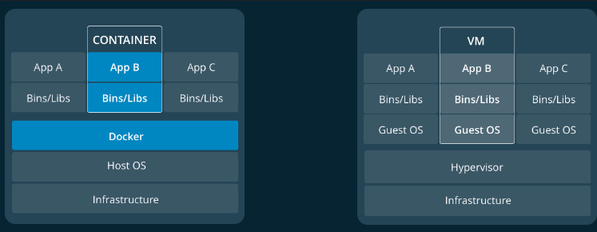

# docker（一）: 安装
## 开始

docker是一个可以帮助开发者使用容器（containers）开发、部署和运行应用程序的平台。llinux下使用容器部署系统称为containerization。    
container 是映像（image）的运行实例，image包括应用的源文件、运行库、配置文件等运行应用程序时所需要的一切资源。     
container与其他进程一样共享主机的内核。而虚拟机则是一个完整的操作系统，相当于拥有自己独立的系统内核，container比虚拟机更加轻量。  

对比container与虚拟机的结构可以发现，其在应用程序和系统之间增加docker层，而container与其一般进程行为相似。虚拟机是在硬件与操作系统之间增加了hypervisor层，hypervisor层往上是主机的操作系统和虚拟机的操作系统，主机操作系统无法之间调用虚拟机的应用程序。
## 安装docker
[下载网页](https://docs.docker.com/engine/installation/)  
如果之前安装过旧版本的docker，需要先卸载docker  
```bash
sudo apt-get remove docker docker-engine docker.io containerd runc
```  

执行以下命令以允许通过https安装

```bash
$ sudo apt-get install \
    apt-transport-https \
    ca-certificates \
    curl \
    gnupg-agent \
    software-properties-common
```
添加docker官方密钥

```bash
curl -fsSL https://download.docker.com/linux/ubuntu/gpg | sudo apt-key add -
```
验证密钥获取是否成功

```bash
$ sudo apt-key fingerprint 0EBFCD88
    
pub   rsa4096 2017-02-22 [SCEA]
      9DC8 5822 9FC7 DD38 854A  E2D8 8D81 803C 0EBF CD88
uid           [ unknown] Docker Release (CE deb) <docker@docker.com>
sub   rsa4096 2017-02-22 [S]
```
根据电脑系统选择合适仓库，具体信息可以查看[官网](https://docs.docker.com/install/linux/docker-ce/ubuntu/#install-using-the-repository)
```bash
sudo add-apt-repository \
   "deb [arch=amd64] https://download.docker.com/linux/ubuntu \
   $(lsb_release -cs) \
   stable"
```
国外的网站连接速度慢，可以改用国内的镜像网站，下面是中科大的源
```bash
curl -fsSL https://mirrors.ustc.edu.cn/docker-ce/linux/ubuntu/gpg | sudo apt-key add -
sudo add-apt-repository "deb [arch=amd64] https://mirrors.ustc.edu.cn/docker-ce/linux/ubuntu \
$(lsb_release -cs) stable"
```
安装docker
```bash
 sudo apt-get update
sudo apt-get install docker-ce docker-ce-cli containerd.io
```

验证是否安装成功
```bahs
 sudo docker run hello-world
```
## docker配置
### 使用一般用户允许docker
安装玩docker后，想要运行docker必须要有管理员权限，通过为docker创建分组，可以让一般权限使用docker  
```bash
 sudo groupadd docker        # 添加docker分组
 sudo usermod -aG docker $USER   # 将当前用户添加到分组
```

通过`newgrp docker `命令更新分组
验证一般权限允许docker
```bash
docker run hello-world
```
注销账户后会导致上诉配置消失。
## 相关命令
```bash
## List Docker CLI commands
docker
docker container --help

## Display Docker version and info
docker --version
docker version
docker info

## Execute Docker image
docker run hello-world

## List Docker images
docker image ls

## List Docker containers (running, all, all in quiet mode)
docker container ls
docker container ls --all
docker container ls -aq
```
##  相关连接

[官网开始文档](https://docs.docker.com/get-started/)