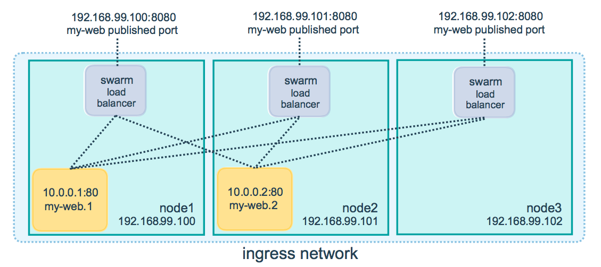

# docker使用入门（四）：集群swarm
swarm是一组位于同一集群且运行docker的机器，用户可以通过swarm manager向swarm输入命令，swarm中的机器可以是虚拟机也可以是物理机。  
swarm中分为swarm manager和workers。用户通过swarm manager管理swarm，worker只提供处理能力，对worker的管理操作都是通过swarm manager进行的  

## 创建swarm　

### 创建虚拟机　

linux下的docker-machine需要手动安装，安装方案见[官方教程](https://docs.docker.com/machine/install-machine/#installing-machine-directly)  

此外还需要在linux上安装virtualbox，运行以下命令进行安装

```bash
sudo apt-get install virtualbox
```

运行以下命令创建两台虚拟机

```bash
docker-machine create --driver virtualbox myvm1
docker-machine create --driver virtualbox myvm2
```

第一次运行时，需要从github上下载文件，如果下载较慢，可以提前将[boot2docker.iso](https://github.com/boot2docker/boot2docker/releases)下载到` ~/.docker/machine/cache/`

使用`docker-machine ls`可以列出虚拟机的信息

```bash
$ docker-machine ls
NAME    ACTIVE   DRIVER       STATE     URL                         SWARM   DOCKER     ERRORS
myvm1   -        virtualbox   Running   tcp://192.168.99.102:2376           v19.03.1   
myvm2   -        virtualbox   Running   tcp://192.168.99.100:2376           v19.03.1   
```

### 配置swarm
使用`docker-machine ssh`可以向虚拟机传达指令，现在使用以下指令将vm1设置为swarm manager，令其能够执行swarm管理命令并且验证worker加入swarm。   

```bash
docker-machine ssh myvm1 "docker swarm init --advertise-addr <myvm1 ip>"
```

执行结果如下

```bash
$ docker-machine ssh myvm1 "docker swarm init --advertise-addr 192.168.99.102"
Swarm initialized: current node (th2pw563bvvfzvqkd98tsne52) is now a manager.

To add a worker to this swarm, run the following command:

    docker swarm join --token SWMTKN-1-33l8tomuwv9cyt9ig54cztdpl4h9kyfc5vimlv58mb6zdn4fiw-dn3ic01jklavcvvsb8ltr86bu 192.168.99.102:2377

To add a manager to this swarm, run 'docker swarm join-token manager' and follow the instructions.
```

*注意：`docker swarm init`和`docker swarm join`命令通常使用端口2377执行，`docker-machine ls`使用端口2376执行，要确保这些端口不被占用*   

使用以下命令将vm2添加到swarm中

```bash
docker-machine ssh myvm2 "docker swarm join \
--token <token> \
<ip>:2377"
```

执行结果如下
```bash
$ docker-machine ssh myvm2 " docker swarm join --token SWMTKN-1-33l8tomuwv9cyt9ig54cztdpl4h9kyfc5vimlv58mb6zdn4fiw-dn3ic01jklavcvvsb8ltr86bu 192.168.99.102:2377"
This node joined a swarm as a worker.
```

myvm2中执行的命令可以直接复制添加myvm1时返回的命令提示信息

在manager中运行`docker node ls`可以查看节点信息
```bash
$ docker-machine ssh myvm1 "docker node ls"
ID                            HOSTNAME            STATUS              AVAILABILITY        MANAGER STATUS      ENGINE VERSION
th2pw563bvvfzvqkd98tsne52 *   myvm1               Ready               Active              Leader              19.03.1
figr3d9s2dhwff1fjxuzo1jvw     myvm2               Ready               Active                                  19.03.1
```

## 将应用程序部署到swarm上
### 关联manager和shell
运行以下指令将shell与vm1关联到一起
```bash
$ docker-machine  env myvm1
export DOCKER_TLS_VERIFY="1"
export DOCKER_HOST="tcp://192.168.99.102:2376"
export DOCKER_CERT_PATH="/home/yzh/.docker/machine/machines/myvm1"
export DOCKER_MACHINE_NAME="myvm1"
# Run this command to configure your shell: 
# eval $(docker-machine env myvm1)
```

执行以下命令使配置生效

```bash
eval $(docker-machine env myvm1)
```

执行成功后，执行`docker-machine ls`可以看到myvm1的状态已经改变

```bash
$ docker-machine ls
NAME    ACTIVE   DRIVER       STATE     URL                         SWARM   DOCKER     ERRORS
myvm1   *        virtualbox   Running   tcp://192.168.99.102:2376           v19.03.1   
myvm2   -        virtualbox   Running   tcp://192.168.99.100:2376           v19.03.1   
```
以上配置仅在当前shell有效，在其他shell中需要重新配置，也可在当前shell重新执行以上指令覆盖原有的设置。   
### 部署应用程序
将应用程序部署到swarm的命令与之前一样，不过现在该命令执行在与manager关联的shell上，通过manager在swarm上执行

```bash
docker stack deploy -c docker-compose.yml hello
```

执行`docker stack ps getstartedlab`可以发现实例分布在不同的虚拟机上，实现负载均衡

```bash
$ docker stack ps hello
ID                  NAME                IMAGE                  NODE                DESIRED STATE       CURRENT STATE              ERROR               PORTS
cm0siz2mmwbt        hello_web.1         yezh01/getstart:v1.0   myvm2               Running             Preparing 19 seconds ago                       
8a6nlkz0b0di        hello_web.2         yezh01/getstart:v1.0   myvm2               Running             Preparing 19 seconds ago                       
dx3g10vswgs8        hello_web.3         yezh01/getstart:v1.0   myvm1               Running             Preparing 19 seconds ago                       
lr2mi3gpjgcz        hello_web.4         yezh01/getstart:v1.0   myvm2               Running             Preparing 20 seconds ago                       
sax7rtkm3ro4        hello_web.5         yezh01/getstart:v1.0   myvm1               Running             Preparing 20 seconds ago    
```

### 测试应用程序

可以通过任意一个虚拟机的ip地址访问应用程序，而且访问效果相同，都可以访问到swarm中的所有运行实例，在swarm中的示意图如下所示


## 相关命令
```bash
docker-machine create --driver virtualbox myvm1 # Create a VM (Mac, Win7, Linux)
docker-machine create -d hyperv --hyperv-virtual-switch "myswitch" myvm1 # Win10
docker-machine env myvm1                # View basic information about your node
docker-machine ssh myvm1 "docker node ls"         # List the nodes in your swarm
docker-machine ssh myvm1 "docker node inspect <node ID>"        # Inspect a node
docker-machine ssh myvm1 "docker swarm join-token -q worker"   # View join token
docker-machine ssh myvm1   # Open an SSH session with the VM; type "exit" to end
docker node ls                # View nodes in swarm (while logged on to manager)
docker-machine ssh myvm2 "docker swarm leave"  # Make the worker leave the swarm
docker-machine ssh myvm1 "docker swarm leave -f" # Make master leave, kill swarm
docker-machine ls # list VMs, asterisk shows which VM this shell is talking to
docker-machine start myvm1            # Start a VM that is currently not running# docker使用入门（四）：集群swarm
swarm是一组位于同一集群且运行docker的机器，用户可以通过swarm manager向swarm输入命令，swarm中的机器可以是虚拟机也可以是物理机。  
swarm中分为swarm manager和workers。用户通过swarm manager管理swarm，worker只提供处理能力，对worker的管理操作都是通过swarm manager进行的  

## 创建swarm　

### 创建虚拟机　

linux下的docker-machine需要手动安装，安装方案见[官方教程](https://docs.docker.com/machine/install-machine/#installing-machine-directly)  

此外还需要在linux上安装virtualbox，运行以下命令进行安装

```bash
sudo apt-get install virtualbox
```

运行以下命令创建两台虚拟机

```bash
docker-machine create --driver virtualbox myvm1
docker-machine create --driver virtualbox myvm2
```

第一次运行时，需要从github上下载文件，如果下载较慢，可以提前将[boot2docker.iso](https://github.com/boot2docker/boot2docker/releases)下载到` ~/.docker/machine/cache/`

使用`docker-machine ls`可以列出虚拟机的信息

```bash
$ docker-machine ls
NAME    ACTIVE   DRIVER       STATE     URL                         SWARM   DOCKER     ERRORS
myvm1   -        virtualbox   Running   tcp://192.168.99.102:2376           v19.03.1   
myvm2   -        virtualbox   Running   tcp://192.168.99.100:2376           v19.03.1   
```

### 配置swarm
使用`docker-machine ssh`可以向虚拟机传达指令，现在使用以下指令将vm1设置为swarm manager，令其能够执行swarm管理命令并且验证worker加入swarm。   

```bash
docker-machine ssh myvm1 "docker swarm init --advertise-addr <myvm1 ip>"
```

执行结果如下

```bash
$ docker-machine ssh myvm1 "docker swarm init --advertise-addr 192.168.99.102"
Swarm initialized: current node (th2pw563bvvfzvqkd98tsne52) is now a manager.

To add a worker to this swarm, run the following command:

    docker swarm join --token SWMTKN-1-33l8tomuwv9cyt9ig54cztdpl4h9kyfc5vimlv58mb6zdn4fiw-dn3ic01jklavcvvsb8ltr86bu 192.168.99.102:2377

To add a manager to this swarm, run 'docker swarm join-token manager' and follow the instructions.
```

*注意：`docker swarm init`和`docker swarm join`命令通常使用端口2377执行，`docker-machine ls`使用端口2376执行，要确保这些端口不被占用*   

使用以下命令将vm2添加到swarm中

```bash
docker-machine ssh myvm2 "docker swarm join \
--token <token> \
<ip>:2377"
```

执行结果如下
```bash
$ docker-machine ssh myvm2 " docker swarm join --token SWMTKN-1-33l8tomuwv9cyt9ig54cztdpl4h9kyfc5vimlv58mb6zdn4fiw-dn3ic01jklavcvvsb8ltr86bu 192.168.99.102:2377"
This node joined a swarm as a worker.
```

myvm2中执行的命令可以直接复制添加myvm1时返回的命令提示信息

在manager中运行`docker node ls`可以查看节点信息
```bash
$ docker-machine ssh myvm1 "docker node ls"
ID                            HOSTNAME            STATUS              AVAILABILITY        MANAGER STATUS      ENGINE VERSION
th2pw563bvvfzvqkd98tsne52 *   myvm1               Ready               Active              Leader              19.03.1
figr3d9s2dhwff1fjxuzo1jvw     myvm2               Ready               Active                                  19.03.1
```

## 将应用程序部署到swarm上
### 关联manager和shell
运行以下指令将shell与vm1关联到一起
```bash
$ docker-machine  env myvm1
export DOCKER_TLS_VERIFY="1"
export DOCKER_HOST="tcp://192.168.99.102:2376"
export DOCKER_CERT_PATH="/home/yzh/.docker/machine/machines/myvm1"
export DOCKER_MACHINE_NAME="myvm1"
# Run this command to configure your shell: 
# eval $(docker-machine env myvm1)
```

执行以下命令使配置生效

```bash
eval $(docker-machine env myvm1)
```

执行成功后，执行`docker-machine ls`可以看到myvm1的状态已经改变

```bash
$ docker-machine ls
NAME    ACTIVE   DRIVER       STATE     URL                         SWARM   DOCKER     ERRORS
myvm1   *        virtualbox   Running   tcp://192.168.99.102:2376           v19.03.1   
myvm2   -        virtualbox   Running   tcp://192.168.99.100:2376           v19.03.1   
```
以上配置仅在当前shell有效，在其他shell中需要重新配置，也可在当前shell重新执行以上指令覆盖原有的设置。   
### 部署应用程序
将应用程序部署到swarm的命令与之前一样，不过现在该命令执行在与manager关联的shell上，通过manager在swarm上执行

```bash
docker stack deploy -c docker-compose.yml hello
```

执行`docker stack ps getstartedlab`可以发现实例分布在不同的虚拟机上，实现负载均衡

```bash
$ docker stack ps hello
ID                  NAME                IMAGE                  NODE                DESIRED STATE       CURRENT STATE              ERROR               PORTS
cm0siz2mmwbt        hello_web.1         yezh01/getstart:v1.0   myvm2               Running             Preparing 19 seconds ago                       
8a6nlkz0b0di        hello_web.2         yezh01/getstart:v1.0   myvm2               Running             Preparing 19 seconds ago                       
dx3g10vswgs8        hello_web.3         yezh01/getstart:v1.0   myvm1               Running             Preparing 19 seconds ago                       
lr2mi3gpjgcz        hello_web.4         yezh01/getstart:v1.0   myvm2               Running             Preparing 20 seconds ago                       
sax7rtkm3ro4        hello_web.5         yezh01/getstart:v1.0   myvm1               Running             Preparing 20 seconds ago    
```

### 测试应用程序

可以通过任意一个虚拟机的ip地址访问应用程序，而且访问效果相同，都可以访问到swarm中的所有运行实例，在swarm中的示意图如下所示


## 相关命令
```bash
docker-machine create --driver virtualbox myvm1 # Create a VM (Mac, Win7, Linux)
docker-machine create -d hyperv --hyperv-virtual-switch "myswitch" myvm1 # Win10
docker-machine env myvm1                # View basic information about your node
docker-machine ssh myvm1 "docker node ls"         # List the nodes in your swarm
docker-machine ssh myvm1 "docker node inspect <node ID>"        # Inspect a node
docker-machine ssh myvm1 "docker swarm join-token -q worker"   # View join token
docker-machine ssh myvm1   # Open an SSH session with the VM; type "exit" to end
docker node ls                # View nodes in swarm (while logged on to manager)
docker-machine ssh myvm2 "docker swarm leave"  # Make the worker leave the swarm
docker-machine ssh myvm1 "docker swarm leave -f" # Make master leave, kill swarm
docker-machine ls # list VMs, asterisk shows which VM this shell is talking to
docker-machine start myvm1            # Start a VM that is currently not running
docker-machine env myvm1      # show environment variables and command for myvm1
eval $(docker-machine env myvm1)         # Mac command to connect shell to myvm1
& "C:\Program Files\Docker\Docker\Resources\bin\docker-machine.exe" env myvm1 | Invoke-Expression   # Windows command to connect shell to myvm1
docker stack deploy -c <file> <app>  # Deploy an app; command shell must be set to talk to manager (myvm1), uses local Compose file
docker-machine scp docker-compose.yml myvm1:~ # Copy file to node's home dir (only required if you use ssh to connect to manager and deploy the app)
docker-machine ssh myvm1 "docker stack deploy -c <file> <app>"   # Deploy an app using ssh (you must have first copied the Compose file to myvm1)
eval $(docker-machine env -u)     # Disconnect shell from VMs, use native docker
docker-machine stop $(docker-machine ls -q)               # Stop all running VMs
docker-machine rm $(docker-machine ls -q) # Delete all VMs and their disk images
```
## 相关链接
https://docs.docker.com/get-started/part4/
