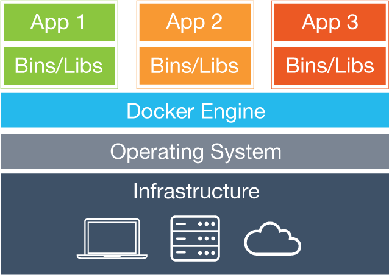
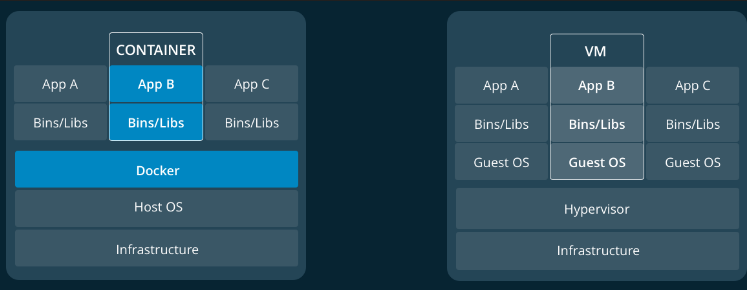
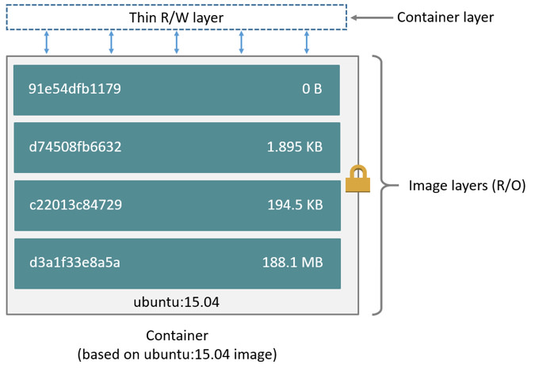
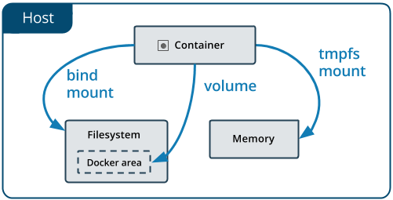

# docker 总结

## 基本概念

docker是一个帮助开发者使用容器进行开发、部署项目的平台。  

### 容器概念

容器是一种轻量级虚拟化，也称为操作系统级虚拟化。它是一个中间件和回显系统，允许在多个称为容器的实例之间共享操作系统。每个容器与其他容器分开，并且可以具有与其他容器和基本操作系统不同的Linux风格。



### 容器和虚拟机的区别

docker可以将应用程序封装在不同的容器中执行并为每个容器提供单独的运行环境，每个容器内部都可以视为一个完整的主机环境，其功能类似于虚拟机，但和虚拟机相比容器更加轻量。虚拟机和主机操作系统的关系是相互独立的，它们共享主机硬件但虚拟机之间以及和主机操作系统之间内核是相互隔离的，虚拟机拥有完整的系统内核。容器是运行在主机操作系统之上的，容器以及主机其他程序共享系统内核，但每个容器拥有自己独立的运行库以及其他运行环境
                      

### 组成结构

docker采用客户端-服务器模式，其主要由以下部分构成：

  

- daemon：是运行在主机上的守护进程，docker的所有操作指令通过该守护进程进行
- API：docker提供的daemon的接口，通过API来控制daemon
- CLI：是docker的客户端，通过命令行或者界面输入docker指令，输入的指令实际会传输给daemon执行
- network：docker提供的网络服务，docker允许容器之间通过多种网络驱动方式进行通信
- image：docker所管理的镜像，其组成结构类型于栈，由多个只读层叠加而成，是生成容器的模板
- container：docker所管理的容器，应用程序运行在容器内部，容器通过镜像构建而成。
- volumes：docker提供的数据存储功能，docker提供与容器独立的数据存储功能以减小容器大小，同时持久化数据，docker提供两种数据存储方式。

## Dockerfile

dockerfile是一个包含构建镜像所需命令的文本文件，docker可以根据dockerfile文件构建镜像   
dockerfile以`from`开始，表示使用另一个镜像作为生成当前镜像的基础，新创建的镜像会包含基础镜像的内容。dockerfile中包含了构建镜像所需的全部命令。

```dockerfile
# 使用python的运行环境作为parent image
FROM python:2.7-slim

# 设置工作路径
WORKDIR /app

# 将当前目录的内容复制到相应路径下
COPY . /app

# 下载requirements.txt中要求的包
RUN pip install --trusted-host pypi.python.org -r requirements.txt

# 暴露容器的80端口
EXPOSE 80

# 定义环境变量
ENV NAME World

#当docker开始运行时执行文件
CMD ["python", "app.py"]
```

## 镜像image

docker中的容器都是基于镜像构成的，镜像是由多个只读层构成，每个只读层记录了dockerfile的一条命令，docker每执行dockerfile的一条命令都会新建一个只读层记录该指令操作结果。

```bash
$ docker history yezh01/getstart:v1.0 
IMAGE               CREATED             CREATED BY                                      SIZE                COMMENT
7ecc82fd960a        7 days ago          /bin/sh -c #(nop)  CMD ["python" "app.py"]      0B                  
54b7ddd84299        7 days ago          /bin/sh -c #(nop)  ENV NAME=World               0B                  
9262b67607c5        7 days ago          /bin/sh -c #(nop)  EXPOSE 80                    0B                  
f595bf8c2004        7 days ago          /bin/sh -c pip install --trusted-host pypi.p…   10.9MB              
baa7e092c815        7 days ago          /bin/sh -c #(nop) COPY dir:c984b678f865c5dd8…   1.19kB              
581ae7fc3818        7 days ago          /bin/sh -c #(nop) WORKDIR /app                  0B                  
5f759d36aead        7 days ago          /bin/sh -c #(nop)  CMD ["python2"]              0B                  
<missing>           7 days ago          /bin/sh -c set -ex;   savedAptMark="$(apt-ma…   7.39MB              
```

docker可以在一个镜像的基础上生成新的镜像，新的镜像不会复制原有镜像的内容而是和原有镜像共享文件数据，这样可以减小镜像大小，提高存储和传输效率。

## 容器

容器内包含了应用程序和其所需的与运行环境，docker可以为每个容器设置不同的运行环境，而且彼此互不干扰。      

容器是根据镜像生成的，容器与镜像很重要的一个区别在于，镜像都是由只读层构成的，而容器在镜像只读层之上构建了一个读写层用于记录对容器的修改操作，因此，容器是可修改的，而镜像是只读的。



一个镜像可以同时生成多个容器副本，容器副本之间共享同一个镜像，不同容器副本只保留自己容器的修改结果。

### 容器读写策略

docker采用写时复制（cop-on-write）策略，当容器需要读取底层层次的数据时，如果不需要对数据进行修改，则直接从底层读取数据；如果需要对数据进行修改，则将数据复制到当前层次进行修改并将修改后的数据保留在当前层次。这样可以减小容器体积同时提高读写效率。

## 应用程序的分级结构

docker对应用程序的执行方式可以分成三级层次结构:

- 堆栈stack
- 服务services
- 容器container

### 容器

容器是应用的最底层，容器内部包含了一个应用程序或者应用程序的一个组件。应用程序都是在容器内部执行的。

### 服务

服务是指应用程序的其中一部分功能，服务可以理解为一群“运行中的容器”，服务中的容器都是根据同一个镜像生成的，服务定义了容器的行为方式，包括：容器对外开放的借口、生成的容器数量等。   服务是通过yml文件进行配置的。

### 集群

docker支持在集群上运行服务，即一个服务可以执行在多台主机或者虚拟机中。  

docker可以将主机设置为集群模式或者加入一个集群，每个集群含有一个管理者manager和若干工作者worker，manager可以控制集群工作，而worker只提供自身的计算能力。集群模式下的控制命令与独立容器的控制命令一致，将命令发送给manager，manager会自动控制集群执行命令。  
集群会自动进行负载均衡，即当manager收到一个提供服务的命令后，集群会自动将服务的容器实例均匀分布到各个集群主机中。

外界对任何一台集群主机的访问的结果都是一致的，外界可以通过一台主机访问集群内所有主机的服务。

### 堆栈

堆栈是一组相互关联的服务，它们共享依赖关系，并且可以协调和缩放在一起。单个堆栈能够定义和协调整个应用程序的功能

## 数据管理

docker使用union file system来管理数据，docker构建image和container也是采用了同样的技术。   
docker支持多种数据存储驱动，官方推荐的最新驱动是overlay2

### 数据存储

由于容器读写层数据在容器结束后会丢失，同时，在容器中记录过多数据会导致容器体积过大，因此，docker提供了而外的数据存储方式：挂载主机文件、挂载docker volume、挂载tmpfs。   

   

- 挂载主机文件是直接将主机中的目录挂载在docker中，这中方式依赖于主机特定的文件系统。
- 挂载docker volume。volume是docker提供的首选数据存储方式，volume独立于容器存在，容器结束后volum不会消失。
- tmpfs是linux上的文件系统，其将数据保留在主机内存中，主机关机后，内存数据丢失，tmpfs上保留的数据也会丢失。

## 网络

docker提供多种网络驱动：
- bridge： docker默认网络驱动，docker提供默认网桥也允许自定义网桥，官方推荐自定义网桥
- overlay：支持不同daemon下的容器之间一个集群服务之间的通信，适用于集群环境
- host： 容器与主机没有网络隔绝，与主机贡献网络，适用于需要隔绝除网络以外的其他部分的场景
- macvlan：为容器分配MAC地址，daemon可以通过容器MAC地址将流量直接路由给容器而无需通过主机网络栈
- none：禁用容器一切网络


