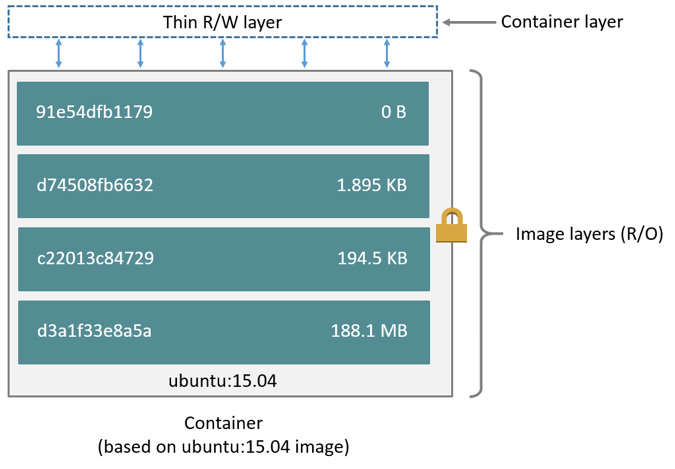

# dicker：数据管理
## 数据管理机制

docker使用union file system来管理数据，docker构建image和container也是采用了同样的技术。

### image层次

iamge由多个层次构成，每个层次包含dockerfile的一条指令，除了最后一层外，其他层次都是只读的。   
```dockerfile
FROM ubuntu:18.04
COPY . /app
RUN make /app
CMD python /app/app.py
```
其一共生成四个层次：
- FROM 根据ubuntu:18.04生成一个层次
- copy将运行docker命令的目录下的文件复制到容器中的app文件中
- run 使用make命令生成应用程序
- cmd 在容器中运行指定命令

docker层次的管理方式类似于git版本管理，层次的结构类似于一个栈，每个层次只记录与之前的层次的差异。当创建一个container时，会在image层次的基础上再创建一个读写层，对容器的修改操作都记录在读写层上而不会修改底层记录的数据。


### container层次

container和image最大的区别在于container比image多了一层读写层用于记录对容器的修改，读写层在容器结束运行后销毁，其所记录的一切结果都不会保留，也不会改变image的数据。

由于container不会修改底层image的数据，所以多个container副本底层可以共享一个image。

###  copy-on-write策略

copy-on-write用于提高共享和复制文件的效率。   
当需要对低层次数据进行读取时，如果不涉及数据修改，那么直接从低层读取现有数据；如果需要修改数据，则将数据拷贝到当前层次进行修改。

当我们将某个image作为base image构建新的image时，新的image不会复制base image的层次，而是共享相同的只读层。

为了存储效率和读写效率，当我们创建一个container时，同样只将要修改的数据复制到读写层中，以此保证容器所占空间最小。

### 存储驱动

docker支持多种存储驱动，官方推荐的驱动程序是overlay2。   


## 数据存储方式

docker中数据存储有三种方式：记录在读写层、挂载主机文件系统、设置volume。  
其中使用读写层记录数据会存在以下问题：    
    
- 数据无法持久化，当容器关闭后，读写层记录的数据就会消失
- 数据不利于共享，其他容器或进程很难获取到容器读写层的数据
- 读写效率低，读写层存储数据需要使用存储驱动，该驱动需要使用linux内核，运行效率低

   
如上图所示，
volume是将数据主机文件系统中docker所管理的区域，bind mount是将主机文件系统中的任何一部分挂载到container中，tmpfs mount是linux上的一个文件管理系统，他所有的数据都存储在内存中而不会保留在硬盘上，所以掉电后，其里面所有数据都会丢失。

## 相关链接

https://docs.docker.com/storage/storagedriver/  
https://docs.docker.com/storage/storagedriver/select-storage-driver/  
https://docs.docker.com/storage/storagedriver/overlayfs-driver$  