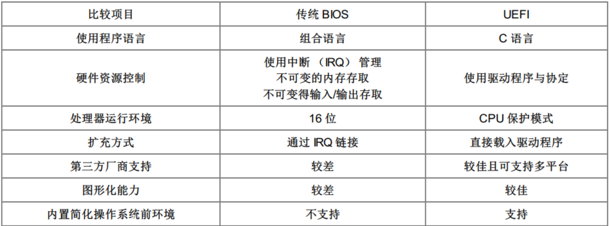
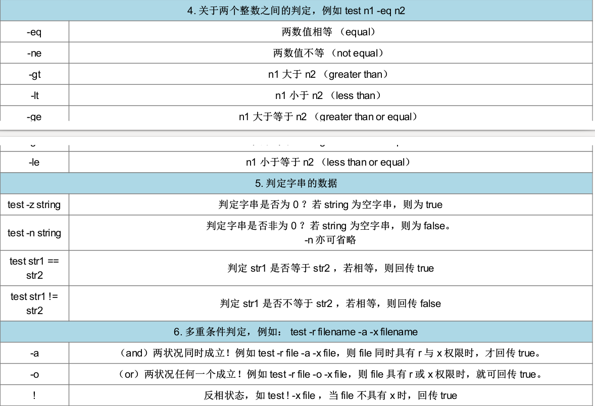

- [TOC]

# 基础篇

## 第二章 主机规划与磁盘分区

### 各硬件在linux中的文件名

| 设备                | 文件名                                                     |
| ------------------- | ---------------------------------------------------------- |
| SCSI/SATA/USB硬盘机 | /dev/sd[a-p]                                               |
| USB闪存             | /dev/sd[a-p]                                               |
| virtl/IO界面        | /dev/vd[0-7] (用于虚拟机内)                                |
| 软盘机              | /dev/fd[0-7]                                               |
| 打印机              | /dev/lp[0-2] (15针)    /dev/usb/lp[0-15] （USB）           |
| 鼠标                | /dev/input/mouse[0-15]  /dev/psaux    /dev/mouse(当前鼠标) |
| CDROM/DVDROM        | /dev/scd[0-1]   /dev/sr[0-1]      /dev/cdrom               |
| 磁带机              | /dev/ht0   /dev/st0    /dev/tape                           |
| IDE硬盘机           | /dev/hd[a-d]                                               |

### 主分区和逻辑分区

主分区： 分区信息记录在分区表内，分区表所存储的分区信息有限

延伸分区：分区信息记录在分区表内，用于割分更多的分区，不可格式化

逻辑分区：分区信息记录在延伸分区表内，割分延伸分区表

GPT没有以上概念

### 开机流程

1. BIOS：开机主动执行的固件，会认识第一个可开机的设备；
2. MBR：第一个可开机设备的第一个扇区内的主要开机记录区块，内含开机管理程序；
3. 开机管理程序（boot loader）：一支可读取核心文件来执行的软件；
4. 核心文件：开始操作系统的功能...



### 目录树结构

> 目录树架构（directory tree）就是以根目录（/）为主，然后向下呈现分支状的目录结构的一种文件架构。 

- **挂载**

利用一个目录当成进入点（挂载点），将磁盘分区的数据放置在该目录下； 也就是说，进入该目录就可以读取该分 区
### 基本操作
- **指令格式**
> $ :一般用户   #： root用户

|指令|说明|
|--|---|
|date|显示时间|
|cal|显示日历|
|bc|计算器|
|ctrl+c|终止指令|
|ctrl+d|键盘输入结束EOF、可取代exit|
|shift+pgdn（pgup）|翻页|
|sync|将数据同步写入硬盘|
|shutdown|关机|
|reboot|重启|
|chgrp|改变档案群组|
|chown|改变档案拥有者|
|chmod|改变档案权限|
|cat|读取文件内容|
|read|读取键盘输入|
|declare或typeset|声明变量名|
[Tab] 接在一串指令的第一个字的后面,则为 “ 命令补全 ” ;
[Tab] 接在一串指令的第二个字以后时,则为 “ 文件补齐 ” !

#### man
（man man）
|编号 |代表内容|
|1| 使用者在 shell 环境中可以操作的指令或可可执行文件|
|2 |系统核心可调用的函数与工具等|
|3| 一些常用的函数( function )与函数库( library ),大部分为 C 的函数库( libc )|
|4| 设备文件的说明,通常在 /dev 下的文件|
|5| 配置文件或者是某些文件的格式|
|6| 游戏( games )|
|7| 惯例与协定等,例如 Linux 文件系统、网络协定、 ASCII code 等等的说明|
|8| 系统管理员可用的管理指令|
|9| 跟 kernel 有关的文件|
#### 笔记
可以通过man或info指令获取指令的详细信息
### 文件
#### 文件属性
- 第一个字符
	- d 目录
	- - 档案
	- l 连结档
	- b 装置文件里的可供存储的接口设备
	- c 装置文件里的串行端口设备
- 三个一组，分别为rwx，分别代表读、写、可执行。第一组为拥有者、第二组为同组群、第三为其他
#### 文件类型
- 正规文件【-】
	1. 纯文本文件
	2. 二进制文件
	3. 数据份格式文件
- 目录【d】
- 链接文件【l】
- 设备与设备文件
	1. 区块设备文件【b】：存储数据的周边设备，硬盘等
		. 字符设备文件【c】：一次性读取设备，鼠标、键盘等	
- 数据接口文件【s】
- 输出传输档【p】
#### 目录配置依据
|不变的|/usr（软件放置处）/opt（第三方协议）|/etc（配置文件） /boot（开机与核心文档）|
|可变的|/var/mail（使用者邮件信箱） /var/spool/news（新闻群组）|/var/run（程序相关） /var/lock（程序相关)|
- 目录定义
/ ( root, 根目录):与开机系统有关;
/usr ( unix software resource ):与软件安装 / 执行有关;
/var ( variable ):与系统运行过程有关。


#### 笔记
- -x权限对目录十分重要，拥有x权限才可以将该目录设为工作目录，才能执行其他指令
- -r权限可以读取到目录内的文件列表，但不能进入目录
- -w权限可以修改目录内的文件，但不能修改文件内容，使用时需要拥有x权限
-linux文件是否可以执行与文件扩展名无关，其通过文件属性设置
- 文件以`.`开头表示隐藏文件
- Linux 的每个文件中,可分别给予使用者、群组与其他人三种身份个别的 rwx 权限;
- 群组最有用的功能之一,就是当你在团队开发资源的时候,且每个帐号都可以有多个群组的支持;
- 利用 ls -l 显示的文件属性中,第一个字段是文件的权限,共有十个位,第一个位是文件类型, 接下来三个为一组共三组,为使用者、群组、其他人的权限,权限有 r,w,x 三种;
- 如果文件名之前多一个 “ . ” ,则代表这个文件为 “ 隐藏文件 ” ;
- 若需要 root 的权限时,可以使用 su - 这个指令来切换身份。处理完毕则使用 exit 离开 su 的指令环境。
- 更改文件的群组支持可用 chgrp ,修改文件的拥有者可用 chown ,修改文件的权限可用 chmod
- chmod 修改权限的方法有两种,分别是符号法与数字法,数字法中 r,w,x 分数为 4,2,1 ;
对文件来讲,权限的性能为:
r :可读取此一文件的实际内容,如读取文本文件的文字内容等;
w :可以编辑、新增或者是修改该文件的内容(但不含删除该文件);
x :该文件具有可以被系统执行的权限。
- 对目录来说,权限的性能为:
r ( read contents in directory )
w ( modify contents of directory )
x ( access directory )
- 要开放目录给任何人浏览时,应该至少也要给予 r 及 x 的权限,但 w 权限不可随便给;
- 能否读取到某个文件内容,跟该文件所在的目录权限也有关系 (目录至少需要有 x 的权限)。
- Linux 文件名的限制为:单一文件或目录的最大容许文件名为 255 个英文字符或 128 个中文字符;
- 根据 FHS 的官方文件指出, 他们的主要目的是希望让使用者可以了解到已安装软件通常放置于那个目录下
- FHS 订定出来的四种目录特色为: shareable, unshareable, static, variable 等四类;
- FHS 所定义的三层主目录为: /, /var, /usr 三层而已;
- 绝对路径文件名为从根目录 / 开始写起,否则都是相对路径的文件名。
### 文件与目录管理
|. |代表此层目录|
|..|代表上一层目录|
|-|代表前一个工作目录|
|~|代表 “ 目前使用者身份 ” 所在的主文件夹|
|~account|代表 account 这个使用者的主文件夹( account 是个帐号名称)|

- 常见目录指令
|cd|变更目录|
|pwd|显示目前的目录|
|mkdir|创建新目录|
|rmdir|删除空目录|
### vi和vim

## 第十章 BASH
### 变量
####  变量使用与设置
```
myname=yezh
```
- 等号两边不能有空格
- 使用单反引号[`command`]或$(command)可以执行额外的命令
```
version=$(uname -r)
```
- 双引号内的特殊字符如`$`保持原有特性
- 单引号内特殊字符与一般字符相同
	 可使用`\`将特殊字符转化为一般字符	
```bash
myhome="$HOME"
#myhome = /home/yeah

myroom='$HOME'
#myroom=$HOME
```
- 使用`${name}`or`$"name"`可扩展变量内容

```bash
myroom=$HOME  #myhome = /home/yeah
myroom=${myhome}:/home/bin
#myhome = /home/yeah:/home/bin
```
- using  variable on other program with `export variablename`  
- canncel  variable with `unset variablename`
- 父进程定义的变量无法在子进程中使用
#### 环境变量功能
> **子进程只继承父进程的环境变量，不继承自定义变量** 
```bash
#查看环境变量
env
export
#查看所有变量（含环境变量和自定义变量）
set
```
#### 变量内容的删除、替换
|||
|---|---|
|`#`|符合删除文字的最短字符串|
|`##`|符合删除文字的最长字符串|
|`%`|从后往前删除|
|`%%`||
|`/old/new`|替换第一个相符关键字|
|`//old/new`|替换全部相符关键字|

## 第十一章 正则表达式

| 特殊符号      | 含义                                  |
| ------------- | ------------------------------------- |
| **[:alnum:]** | 大小写字母与数组，即0~9. a~z, A~Z     |
| **[:alpha:]** | 大小写字母，a~z, A~Z                  |
| [:blank:]     | 空格键与[tab]键                       |
| [:cntrl:]     | 控制按键，CR、LF、Tab、Del等          |
| **[:digit:]** | 数字，0~9                             |
| [:graph:]     | 除空格键和[tab]以外所有按键           |
| **[:lower:]** | 小写字母a~z                           |
| [:print:]     | 可打印字符                            |
| [:punct:]     | 标点符号，“ ? . /等                   |
| **[:upper:]** | 大写字母A~Z                           |
| [:space:]     | 任何会产生空白的字符，空格，TAB, CR等 |
| [:xdigit:]    | 十六进制数字类型，包括0~ 9，a~f， A~F |

|RE 字符| 意义与范例|
|---|---|
|^word |意义:待搜寻的字串( word )在行首!<br> 范例:搜寻行首为 # 开始的那一行,并列出行号<br>`grep -n '^#' regular_express.txt`|
|word$ | 意义:待搜寻的字串( word )在行尾!<br>范例:将行尾为!的那一行打印出来,并列出行号<br>`grep -n '!$' regular_express.txt`|
|. |意义:代表 “ 一定有一个任意字符 ” 的字符!<br>范例:搜寻的字串可以是 (eve)(eae)(eee)(ee),但不能仅有(ee)!亦即e与e中间“一定”仅有一个字符,而空白字符也是字符!<br>`grep -n 'e.e' regular_express.txt`|
|\ | 意义:转义字符,将特殊符号的特殊意义去除!<br>范例:搜寻含有单引号 ' 的那一行!<br>`grep -n \' regular_express.txt|
|*|意义:重复零个到无穷多个的前一个 RE 字符<br>范例:找出含有 ( es ) ( ess ) ( esss ) 等等的字串,注意,因为 * 可以是 0 个,所以 es 也是符合带搜寻字串。另外,因为 * 为重复 “ 前一个 RE 字符 ” 的符号, 因此,在 * 之前必须要紧接着一个 RE 字符喔!例如任意字符则为“.*”!<br>`grep -n 'ess*' regular_express.txt`|
|[list]|意义:字符集合的 RE 字符,里面列出想要撷取的字符!<br>范例:搜寻含有 ( gl ) 或 ( gd ) 的那一行,需要特别留意的是,在 [] 当中 “ 谨代表一个待搜寻的字符 ” , 例如 “a[afl]y ” 代表搜寻的字串可以是 aay, afy, aly 即 [afl] 代表 a 或 f 或 l 的意思!<br>`grep -n 'g[ld]' regular_express.txt`|
|[n1-n2]|意义:字符集合的 RE 字符,里面列出想要撷取的字符范围!<br>范例:搜寻含有任意数字的那一行!需特别留意,在字符集合 [] 中的减号 - 是有特殊意义的,他代表两个字符之间的所有连续字符!但这个连续与否与 ASCII 编码有关,因此,你的编码需要设置正确(在 bash 当中,需要确定 LANG 与 LANGUAGE 的变量是否正确!) 例如所有大写字符则为 [A-Z]<br>`grep -n '[A-Z]' regular_express.txt`|
|`[^list]`|意义:字符集合的 RE 字符,里面列出不要的字串或范围!<br>范例:搜寻的字串可以是 ( oog ) ( ood ) 但不能是 ( oot ) ,那个 ^ 在 [] 内时,代表的意义是 “ 反向选择 ” 的意思。 例如,我不要大写字符,则为 [^A-Z] 。但是,需要特别注意的是,如果以 grep -n [^A-Z] regular_express.txt 来搜寻,却发现该文件内的所有行都被列出,为什么?因为这个 [^A-Z] 是 “ 非大写字符 ” 的意思, 因为每一行均有非大写字符,例如第一行的"Open Source" 就有 p,e,n,o.... 等等的小写字`grep -n 'oo[^t]' regular_express.txt`|
|\{n,m\}|意义:连续 n 到 m 个的 “ 前一个 RE 字符 ”<br>意义:若为 \{n\} 则是连续 n 个的前一个 RE 字符,<br>意义:若是 \{n,\} 则是连续 n 个以上的前一个 RE 字符! <br>范例:在 g 与 g 之间有 2 个到 3 个的 o 存在的字串,亦即 ( goog )( gooog )<br>`grep -n 'go\{2,3\}g' regular_express.txt`|


## 第十二章 shell脚本

```bash
#!/bin/bash
#program
#  creat one file named by user's input and date command

read -p "please input file name: " fileuser
filename=${fileuser:-"backup"}
datestr=$(date +%y%m%d)
filename=${filename}-${datestr}
touch "${filename}"
```

**对变量赋值时，等号两边不能有空格**

### 执行方式

1. source

   在父进程中执行

2. sh script
	在子进程中执行
4. ./script

   需要将文件设置为可执行文件

   ```bash
   chmod +x <filename>
   ```
###判断式

#### `test`命令


#### `[]`判断符号

> - `[]`中的每个元素都需要用空格隔开
>
> - `[]`中的变量应使用双引号
>
> - `[]` 中的常数应使用双引号或单引号

### 默认变量

```bash
$command opt1 opt2 opt3 ....
#   $0 	  $1    $2   $3   ....
#参数
$#  		#参数个数
$@  	       #将参数串联起来，"$1""$2"...
$* 		 	#将参数串联起来，以空格隔开， "$1 $2 $3 ..."
shift  		    #参数变量偏移
```
### 条件判断式
```bash
if [command]; then
	command
fi

if [command]; then
	command
else
	command
fi

if [command]; then
	command
elif [command]; then
	command
else
	command
fi
if..
```

```bash
case ${variable} in
	"<str1>")
		command
		;;
	"<str2>")
		command
		;;
	*)
		command
		;;
esac
```
### `function`函数
```bash
function <name>(){
	command
}
```
### 循环
```bash
while [ condition ]
do
	command
done
```
```bash
until [condition]
do 
	command
done
```
```bash
for var in con1 con2 con3 ...
do
	command
done

for num in $(seq 1 100)
do 
	command
done

for num in {1..100}
do
	command
done
```
```bash
for (( 初始值；限制值；赋值运算 ))
do
	command
done
```
### 随机数
```bash
${RANDOM}

${RANDOM}*num/32767+1  #取1～num随机数
```

