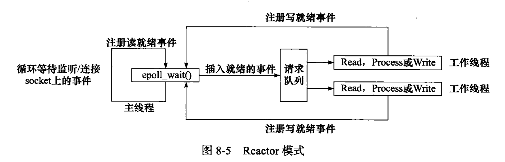

# linux 高性能服务器

- [linux 高性能服务器](#linux-高性能服务器)
  - [TCP/IP协议族](#tcpip协议族)
    - [常用指令](#常用指令)
  - [高性能服务器框架](#高性能服务器框架)
    - [Reactor模式](#reactor模式)

## TCP/IP协议族

### 常用指令

```shell
host   #查询ip地址
host -t A www.baidu.com

tcpdump   #抓包
```

## 高性能服务器框架

### Reactor模式


