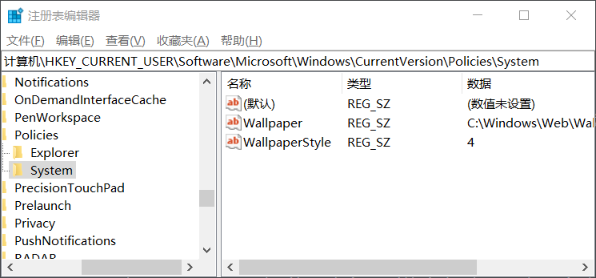
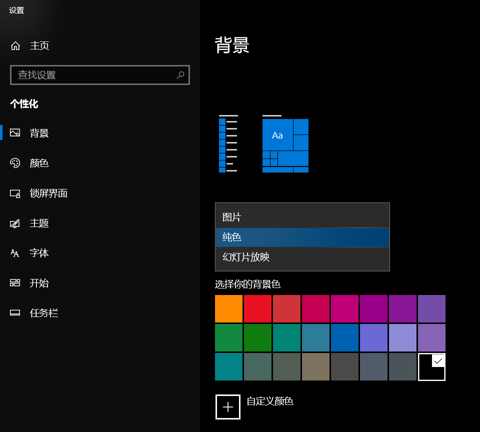
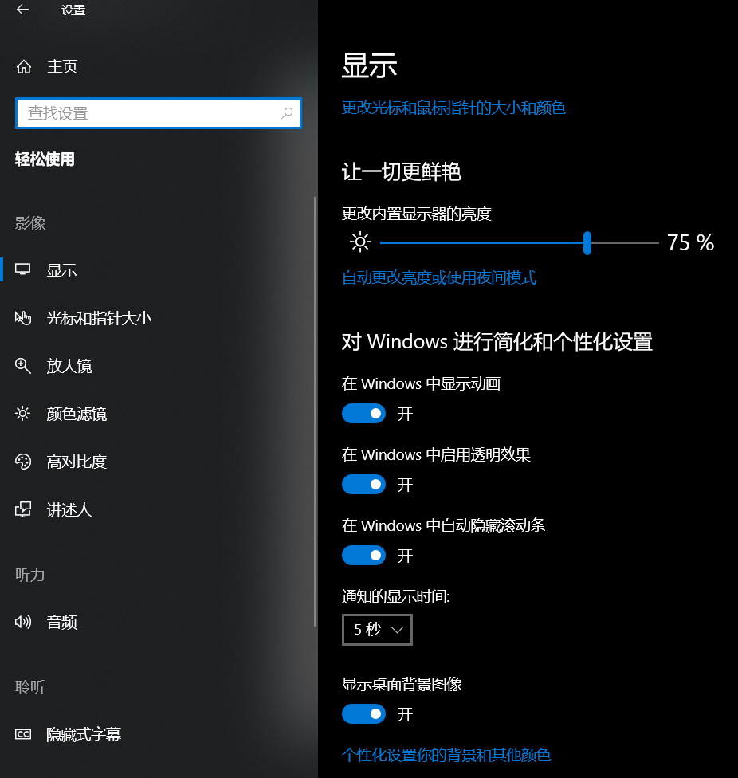

# 加域电脑桌面壁纸无法设置（win10）

win10电脑加入公司的域后，桌面壁纸显示为黑色且无法在个性化中修改。

解决方案如下：

## 修改注册表

运行`regedit`打开注册表，找到路径`计算机\HKEY_CURRENT_USER\Software\Microsoft\Windows\CurrentVersion\Policies\Explorer`下的system，里面对应的是电脑的壁纸设置

删除此项后，可以在个性化中显示壁纸修改操作

此时可以选中图片作为背景的选项，但是返回桌面后系统依然强制为纯色背景，与之前不同的是，可以选择背景颜色

## 打开`显示桌面背景图像`

开启后，再次尝试设置壁纸

如果到了这一步还没有生效，可以尝试重启电脑，我进行到这一步的时候刚好进行更新重启，重启完之后壁纸就可以正常修改了。

