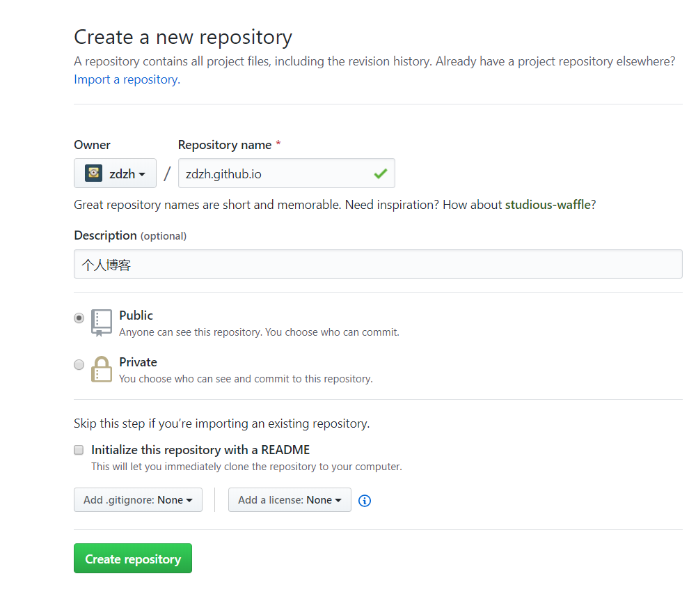
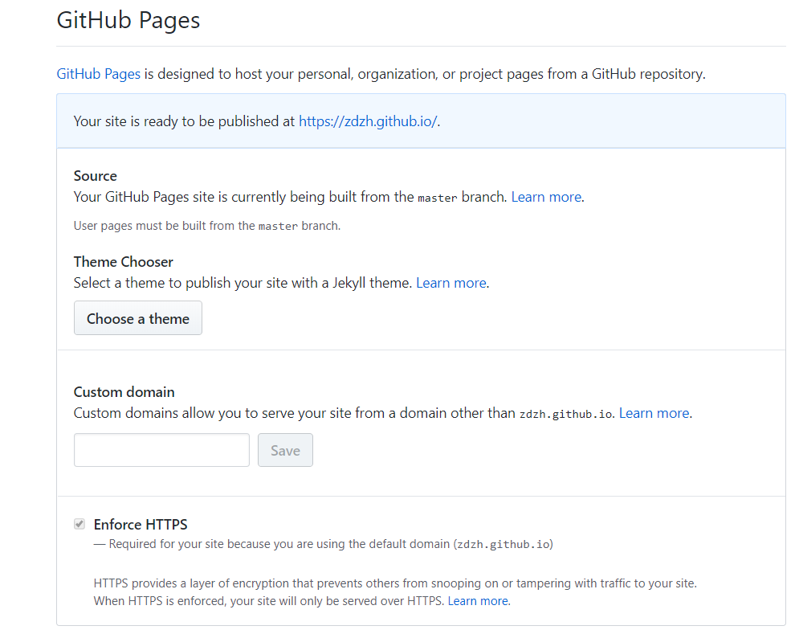
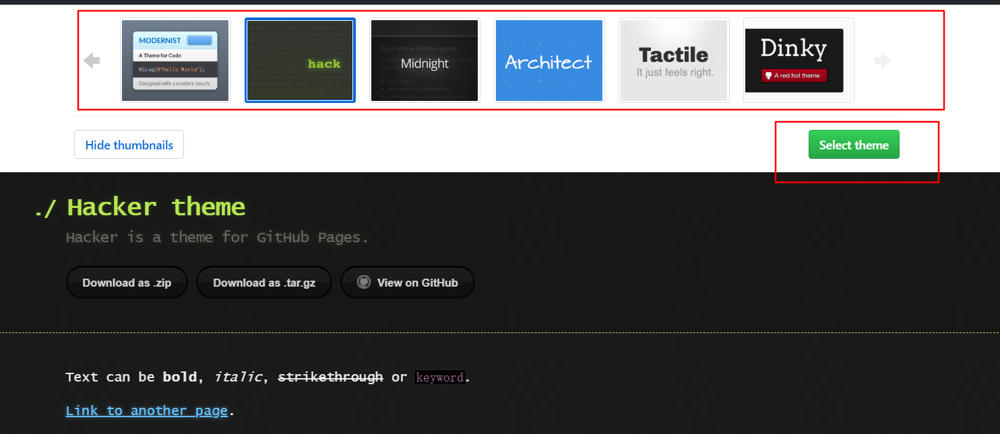
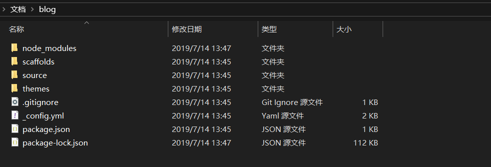
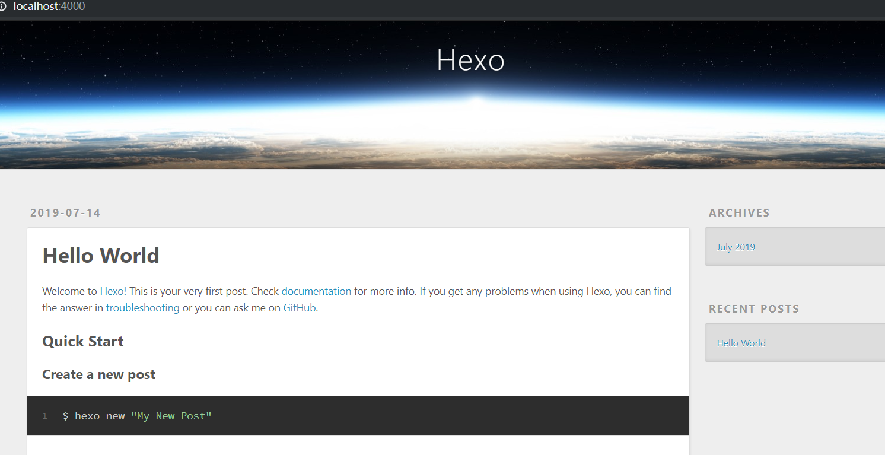
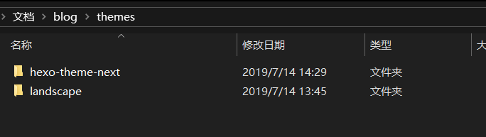

# 搭建博客

## 使用github搭建博客

###  创建仓库

在自己的GitHub账号下创建仓库`<账号名>.github.io`



在仓库的设置里面可以看到`github pages`内容，其中可以看到博客对应的链接，如下图的https://zdzh.github.io/.



### 选择主题

点击`choose a theme` 可以选择博客显示主题



在上面一栏中选择自己喜欢的主题，然后点击`selecet theme`选择主题

### 安装node.js和Hexo

1. 在Node.js[官网](https://nodejs.org/en/)上下载node.js，按提示安装软件。安装完成后输入`node -v`可以查看是否安装成功以及安装的版本

2. 安装hexo

   Hexo是一个简单、快速、强大的基于 Github Pages 的博客发布工具，支持Markdown格式，有众多优秀插件和主题。[hexo官网](https://hexo.io/zh-cn/)               [hexo GitHub](https://github.com/hexojs/hexo)

   在自己的电脑中创建一个空文件夹作为博客文件存放地址。使用命令行进入该目录下，输入以下指令安装Hexo

```cmd
npm install -g hexo
```


### 初始化

使用命令行在上述路径中输入`hexo init`初始化文件夹，该文件夹必须是空文件夹否则初始化失败，指令运行成功后，会在该文件夹下创建若干文件



之后，输入以下指令打开服务器

```bash
hexo g 		# 生成静态网页
hexo s 			#打开本地服务器
```



打开浏览器，输入http://localhost:4000/,可以查看hexo预先生成的网页。若网页无法打开，则有可能是端口占用问题，可以查看文档如何修改端口。

### 修改主题

完成以上步骤后，网站的基本框架已经搭建完成，下一步是将网站的主题更换为自己喜欢的样式

可以自行在网上搜索自己喜欢的主题，选中主题后，找到其对应的仓库地址，将其克隆到当前目录的themes下

```bash
git clone https://github.com/idhyt/hexo-theme-next.git  
```

克隆完成后，在themes可以看到克隆下来的文件



修改_config.yml文件，将`theme`对应字段改为主题名，及上面克隆下来的文件名

```
theme: hexo-theme-next
```

执行`hexo g`重新生成。若这一步出现问题，可以执行`hexo clean`清除之前的内容，之后再重新生成和发布。

### 上传到github

上传前首先需要下载一个插件

```
npm install hexo-deployer-git --save
```

配置`_config.yml`,修改`deploy`字段为以下内容

```bash
# Deployment
## Docs: https://hexo.io/docs/deployment.html
deploy:
  type: git
  repository: git@github.com:zdzh/zdzh.github.io.git       #在github中生成的仓库链接
  branch: master
```

最后输入`hexo -d`上传到GitHub即可

### 发布文章

使用


