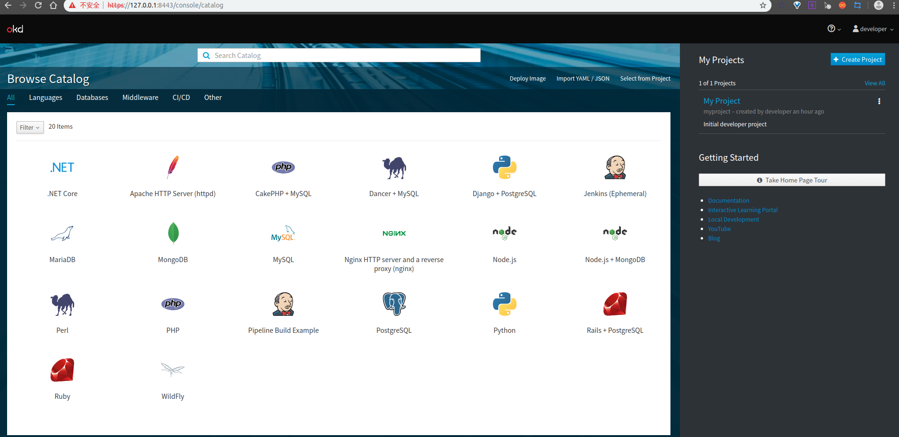

title: openshift--OKD
tags:
  - openshift
  - OKD
categories:
  - openshift
author: yezh
date: 2019-08-09 10:25:22
updated: 2019-08-09 10:25:22
---

# openshift--OKD
OKD是Kubernetes的发行版，针对持续应用程序开发和多租户部署进行了优化。OKD在Kubernetes之上添加了开发人员和运营工具，以便为小型和大型团队实现快速的应用程序开发，轻松部署和扩展以及长期生命周期维护。
OKD是嵌入了Red Hat OpenShift中的上游Kubernetes发行版，并通过安全性和其他集成概念进行扩展。 OKD在github和文档中也称为Origin。
<!--more-->

## 安装

在[官网](https://www.okd.io/download.html)下载okd的最新版本，下载步骤可以参考[官方文档](https://github.com/openshift/origin/blob/v4.0.0-alpha.0/docs/cluster_up_down.md),其主要包括以下内容：
1. 安装OKD之前需要先安装docker，okd与docker的版本需要对应，对应关系可以参考[兼容性表](https://github.com/openshift/origin/blob/v4.0.0-alpha.0/docs/cluster_up_down.md#prerequisites)
2. 确定`sysctl net.ipv4.ip_forward`被设置为1
3. 配置docker daemon参数：
在`/etc/docker/daemon.json`中加入以下内容
```bash
{
   "insecure-registries": [
     "172.30.0.0/16"
   ]
}
```
重启docker daemon 
```bash
$ sudo systemctl daemon-reload
$ sudo systemctl restart docker
```
4. 将openshift解压到自定义路径下，并将路径加入到`$PATH`中，在linux下，可以在`~/.bashrc`中加入`PATH=$PATH`
5. 执行`oc cluster up`
*注意：`oc cluster`指令只能在1.3以上的版本使用*
oc cluster up命令启动本地OpenShift一体化群集，其中包含已配置的注册表，路由器，图像流和默认模板。oc cluster up命令将创建一个默认用户和项目，一旦完成，将允许我们开始使用命令行来创建和部署具有oc new-app，oc new-build和oc run等命令的应用程序。它还将打印出一个URL以访问群集的管理控制台。
如果想要停止cluster可以输入`oc cluster down`

## 使用

开始之前，需要确认以下几点：   
1.  在github上fork[ruby](https://github.com/sclorg/ruby-ex)项目（或自己选择的想要创建的项目）
2. 已经使用  `oc cluster up`运行okd实例，执行成功后，会返回一个本地端口地址
```bash
$ oc cluster up

The server is accessible via web console at:
    https://127.0.0.1:8443

You are logged in as:
    User:     developer
    Password: <any value>

To login as administrator:
    oc login -u system:admin
```

用浏览器打开该地址就可以看到控制台界面

在页面的左边选择Ruby，之后根据要求填写内容。唯一需要注意的一项是git仓库地址，这里填写之前使用的克隆地址
点击右边的myproject，在overview页面中可以查看已创建的内容