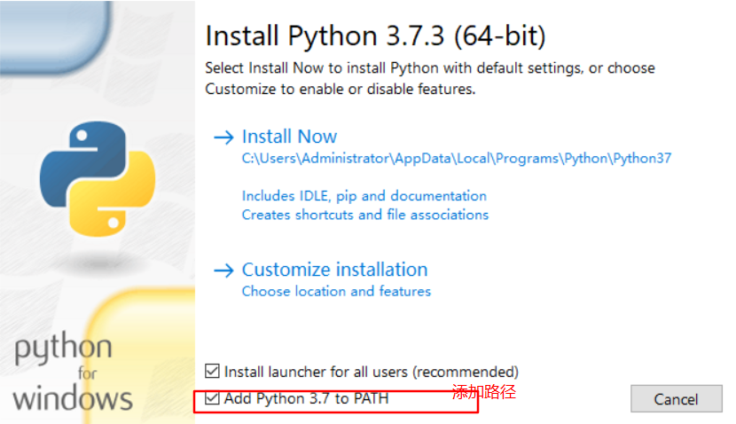
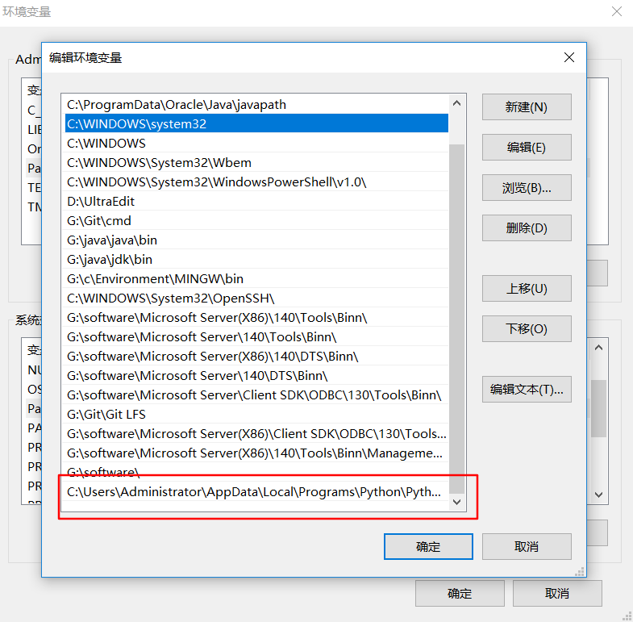
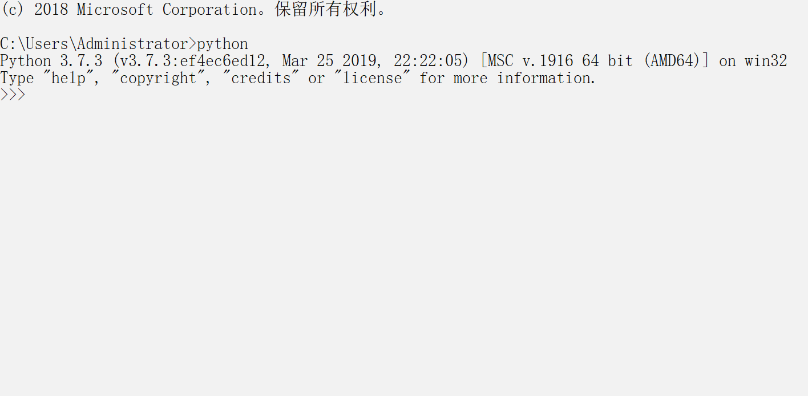

# Python study notes

- 学习网站
  - [廖雪峰官方网站](<https://www.liaoxuefeng.com/wiki/1016959663602400/1017317609699776> )
- [python内置函数](<https://docs.python.org/3/library/functions.html> )

# python环境安装

[官网下载](https://www.python.org/downloads/release/python-373/ )

打开安装软件，勾选添加路径，点击开始安装



在环境变量`Path`中添加`python.exe`的路径



设置全局变量后，在cmd中输入`python`打开python交互模式，即安装成功



#　开始

```bash
python  #进入交互模式
python <filename> #运行文件
```

## 运行py文件

1. 通过python命令
  
```bash
python <filename>
```

1. 直接运行文件
    - 在py文件中加入`#!/usr/bin/env python3`
    - 通过`chmod a+X <filename>` 为文件添加执行权限
    - 直接运行py文件

# 基础

## 语句

- `#`作为注释行开头
- `pass`代表空语句，表示什么都不做
- 当语句以`：`结尾时，缩进语句视为代码块
- 允许使用`r'……'`表示`''`内的字符串默认不转义
```python
#转义测试
print("I'm ok")
print('it is "love"')
print('I \'m ok')
print(r'1\t\t\1')
print('1\t\t1')

```
- Python允许用 `'''...'''`的格式表示多行内容
```python
#换行测试
print('''lin1
        lin2
        lin3
        lin4''')
#error
# print('lin1  
#            lin2')
```

## 函数

### 函数定义

> 在Python中，定义一个函数要使用`def`语句，依次写出函数名、括号、括号中的参数和冒号`:`，然后，在缩进块中编写函数体，函数的返回值用`return`语句返回 

```python
def my_abs(x):
    if x >= 0:
        return x
    else:
        return -x
```

### 参数

#### 参数检查

数据类型检查可以用内置函数`isinstance()`实现：

```python
def my_abs(x):
    if not isinstance(x, (int, float)):
        raise TypeError('bad operand type')
    if x >= 0:
        return x
    else:
        return -x
```

```bash
# 运行结果
>>> my_abs("sa")
Traceback (most recent call last):
  File "<stdin>", line 1, in <module>
  File "<stdin>", line 3, i
```

#### 位置参数

 即c/c++中的一般参数

#### 默认参数

- **默认参数必须指向不变对象！** 

#### 可变参数

> 定义可变参数和定义一个list或tuple参数相比，仅仅在参数前面加了一个`*`号。在函数内部，参数`numbers`接收到的是一个tuple，因此，函数代码完全不变。但是，调用该函数时，可以传入任意个参数，包括0个参数 

```python
def calc(*numbers):
    sum = 0
    for n in numbers:
        sum = sum + n * n
    return sum
```

#### 关键字参数

> 关键字参数允许你传入0个或任意个含参数名的参数，这些关键字参数在函数内部自动组装为一个dict。

```python
def person(name, age, **kw):
    print('name:', name, 'age:', age, 'other:', kw)
```

函数`person`除了必选参数`name`和`age`外，还接受关键字参数`kw`。在调用该函数时，可以只传入必选参数：

```python
>>> person('Michael', 30)
name: Michael age: 30 other: {}
```

也可以传入任意个数的关键字参数：

```python
>>> person('Bob', 35, city='Beijing')
name: Bob age: 35 other: {'city': 'Beijing'}
>>> person('Adam', 45, gender='M', job='Engineer')
name: Adam age: 45 other: {'gender': 'M', 'job': 'Engineer'}
```

#### 命名关键字参数

如果要限制关键字参数的名字，就可以用命名关键字参数，例如，只接收`city`和`job`作为关键字参数。这种方式定义的函数如下：

```python
def person(name, age, *, city, job):
    print(name, age, city, job)
```

和关键字参数`**kw`不同，命名关键字参数需要一个特殊分隔符`*`，`*`后面的参数被视为命名关键字参数。

调用方式如下：

```python
>>> person('Jack', 24, city='Beijing', job='Engineer')
Jack 24 Beijing Engineer
```

如果函数定义中已经有了一个可变参数，后面跟着的命名关键字参数就不再需要一个特殊分隔符`*`了：

```python
def person(name, age, *args, city, job):
    print(name, age, args, city, job)
```

命名关键字参数必须传入参数名，这和位置参数不同。如果没有传入参数名，调用将报错：

```python
>>> person('Jack', 24, 'Beijing', 'Engineer')
Traceback (most recent call last):
  File "<stdin>", line 1, in <module>
TypeError: person() takes 2 positional arguments but 4 were given
```

#### 参数组合

> 在Python中定义函数，可以用必选参数、默认参数、可变参数、关键字参数和命名关键字参数，这5种参数都可以组合使用。但是请注意，参数定义的顺序必须是：**必选参数、默认参数、可变参数、命名关键字参数和关键字参数。 **

#### 参数区别

| 参数类别       | 定义                                           | 使用                                                         |
| -------------- | ---------------------------------------------- | ------------------------------------------------------------ |
| 位置参数       | 给出参数名称，与c/c++中的一般参数作用一致      | 用法与C/C++中类似                                            |
| 默认参数       | 与c++默认参数一致                              | 与c++默认参数类似                                            |
| 可变参数       | 在参数名称前加`*`                              | 与c/c++可变参数类似                                          |
| 关键字参数     | 在参数名称前加 `**`                            | 对关键字参数赋值时需要给出参数名称                           |
| 命名关键字参数 | 需要特殊分割符`*`,若已定义可变参数则无需分割符 | 对关键字参数赋值时需要给出参数名称，且参数名称只能在给定命名关键字范围内 |

### 返回多个值

返回多个值时，其实际返回`tuple`

```python
import math

def move(x, y, step, angle=0):
    nx = x + step * math.cos(angle)
    ny = y - step * math.sin(angle)
    return nx, ny
```

```python
# 运行结果
>>> def move(x, y, step, angle=0):
...     nx = x + step * math.cos(angle)
...     ny = y - step * math.sin(angle)
...     return nx, ny
...
>>> nx,ny = move(10,20,30)
>>> print(nx,ny)
40.0 20.0
```

# 高级特性

## 切片

可以对`list`, `tuple`, `string`进行切片

```python
L[m:n]   # 表示取索引为n到m-1的元素
L[:m]	#第一个索引是0时，可以省略
L[-n:-m] #支持倒数取片
L[-n:]   # 倒数最后一个索引可以省略
L[:]   #所有元素
L[::n]   #每n个元素取一个
L[:n:m] #前n个元素，每m个取一个
```


```python
>>> list=[1,2,3,4,5,6,7,8]
>>> list[3:6] # 取索引为3到5之间的元素
[4, 5, 6]
>>> list[:3] # 取前3个元素
[1, 2, 3]
>>> list[-3:-1]  # 取倒数第3个到倒数第2个元素
[6, 7]
>>> list[-3:] # 取最后三个元素
[6, 7, 8]
>>> list[:]  # 取全部元素
[1, 2, 3, 4, 5, 6, 7, 8]
>>> list[::2]  # 每隔两个取一个元素
[1, 3, 5, 7]
>>> list[:5:2]  # 前五个元素。每隔2个取一个与元素
[1, 3, 5]
```

## 迭代

只要是可迭代对象，无论有无下标，都可以迭代，比如`dic`, `list`, `str`t就可以迭代：

```python
dict = {'a':1,'b':2, 'c' :3, 'd' : 4}
#默认迭代的是key
>>> for key in dict:
...  print(key)
...
a
b
c
d
# 迭代value
>>> for value in dict.values():
...     print(value)
...
1
2
3
4
# 同时迭代key和value
>>> for k, v in dict.items():
...     print(k,v)
...
a 1
b 2
c 3
d 4
```

### 判断是否可迭代

通过`collections`模块的`Iterable`类型判断 

```python
>>> from collections import Iterable
>>> isinstance(dict,Iterable)
True
```

## 列表生成式

生成list `[1, 2, 3, 4, 5, 6, 7, 8, 9, 10]`可以用`list(range(1, 11))`：

```python
>>> list(range(1, 11))
[1, 2, 3, 4, 5, 6, 7, 8, 9, 10]
```

写列表生成式时，把要生成的元素`x * x`放到前面，后面跟`for`循环，就可以把list创建出来，

```python
>>> [x * x for x in range(1, 11)]
[1, 4, 9, 16, 25, 36, 49, 64, 81, 100]
```

for循环后面还可以加上if判断，这样我们就可以筛选出仅偶数的平方：

```python 
>>> [x * x for x in range(1, 11) if x % 2 == 0]
[4, 16, 36, 64, 100]
```

还可以使用两层循环，可以生成全排列：

```python
>>> [m + n for m in 'ABC' for n in 'XYZ']
['AX', 'AY', 'AZ', 'BX', 'BY', 'BZ', 'CX', 'CY', 'CZ']
```

列表生成式也可以使用两个变量来生成list：

```python
>>> d = {'x': 'A', 'y': 'B', 'z': 'C' }
>>> [k + '=' + v for k, v in d.items()]
['y=B', 'x=A', 'z=C']
```

## 生成器

生成器generator采用边循环边计算的机制获取列表元素

```python
>>> L = [x * x for x in range(10)]
>>> L
[0, 1, 4, 9, 16, 25, 36, 49, 64, 81]
>>> g = (x * x for x in range(10))  # 将列表生成式的[]改为（）即可
>>> g
<generator object <genexpr> at 0x1022ef630>
```

使用`next()`可以获取generator的下一个元素

```python
>>> next(g)
0
>>> next(g)
1
>>> next(g)
4
>>> next(g)
9
>>> next(g)
16
>>> next(g)
25
>>> next(g)
36
>>> next(g)
49
>>> next(g)
64
>>> next(g)
81
>>> next(g)
Traceback (most recent call last):
  File "<stdin>", line 1, in <module>
StopIteration
```

>  generator保存的是算法，每次调用`next(g)`，就计算出`g`的下一个元素的值，直到计算到最后一个元素，没有更多的元素时，抛出`StopIteration`的错误。 
>
> generator后，基本上永远不会调用`next()`，而是通过`for`循环来迭代它，并且不需要关心`StopIteration`的错误。 

定义generator的另一种方法。如果一个函数定义中包含`yield`关键字，那么这个函数就不再是一个普通函数，而是一个generator： 

```python
def fib(max):
    n, a, b = 0, 0, 1
    while n < max:
        print(b)
        a, b = b, a + b
        n = n + 1
    return 'done'
#改为generator
def fib(max):
    n, a, b = 0, 0, 1
    while n < max:
        yield b
        a, b = b, a + b
        n = n + 1
    return 'done'
```

generator和函数的执行流程不一样。函数是顺序执行，遇到`return`语句或者最后一行函数语句就返回。而变成generator的函数，在每次调用`next()`的时候执行，遇到`yield`语句返回，再次执行时从上次返回的`yield`语句处继续执行。 

如果想要拿到返回值，必须捕获`StopIteration`错误，返回值包含在`StopIteration`的`value`中

## 迭代器

- 可以直接作用于`for`循环的对象统称为可迭代对象：`Iterable`。 
- 可以被`next()`函数调用并不断返回下一个值的对象称为迭代器：`Iterator`。 
- 凡是可作用于`for`循环的对象都是`Iterable`类型；
- 凡是可作用于`next()`函数的对象都是`Iterator`类型，它们表示一个惰性计算的序列；
- 集合数据类型如`list`、`dict`、`str`等是`Iterable`但不是`Iterator`，不过可以通过`iter()`函数获得一个`Iterator`对象。
- Python的`for`循环本质上就是通过不断调用`next()`函数实现的，

# 函数式编程

## 高阶函数

### map/reduce

> 既然变量可以指向函数，函数的参数能接收变量，那么**一个函数就可以接收另一个函数作为参数**，这种函数就称之为高阶函数 

- `map()`函数接收两个参数，一个是函数，一个是`Iterable`，`map`将传入的函数依次作用到序列的每个元素，并把结果作为新的`Iterator`返回。 
- `reduce`把一个函数作用在一个序列`[x1, x2, x3, ...]`上，这个函数必须接收两个参数，`reduce`把结果继续和序列的下一个元素做累积计算
### filter

> `filter()`也接收一个函数和一个序列。和`map()`不同的是，`filter()`把传入的函数依次作用于每个元素，然后根据返回值是`True`还是`False`决定保留还是丢弃该元素。 
>
> `filter()`函数返回的是一个`Iterator`，也就是一个惰性序列，所以要强迫`filter()`完成计算结果，需要用`list()`函数获得所有结果并返回list。 

 ### sorted

`sorted()`函数也是一个高阶函数，它还可以接收一个`key`函数来实现自定义的排序，例如按绝对值大小排序：

```python
>>> sorted([36, 5, -12, 9, -21], key=abs)
[5, 9, -12, -21, 36]
```

key指定的函数将作用于list的每一个元素上，并根据key函数返回的结果进行排序。对比原始的list和经过`key=abs`处理过的list：

```python
list = [36, 5, -12, 9, -21]

keys = [36, 5,  12, 9,  21]
```

然后`sorted()`函数按照keys进行排序，并按照对应关系返回list相应的元素：

进行反向排序，不必改动key函数，可以传入第三个参数`reverse=True`：

```python
>>> sorted(['bob', 'about', 'Zoo', 'Credit'], key=str.lower, reverse=True)
['Zoo', 'Credit', 'bob', 'about']
```

## 返回函数

- 注意到返回的函数在其定义内部引用了局部变量`args`，所以，当一个函数返回了一个函数后，其内部的局部变量还被新函数引用， 
- 另一个需要注意的问题是，返回的函数并没有立刻执行，而是直到调用了才执行 
-  **返回闭包时牢记一点：返回函数不要引用任何循环变量，或者后续会发生变化的变量。** 

## 匿名函数

- 关键字`lambda`表示匿名函数，冒号前面的`x`表示函数参数 
- 匿名函数有个限制，就是只能有一个表达式，不用写`return`，返回值就是该表达式的结果 
- 匿名函数也是一个函数对象，也可以把匿名函数赋值给一个变量，再利用变量来调用该函数 

匿名函数`lambda x: x * x`实际上就是：

```
def f(x):
    return x * x
```

## 装饰器

函数对象有一个`__name__`属性，可以拿到函数的名字：

```python
>>> def now():
...     print('2015-3-25')
...
>>> now.__name__
'now'
>>> f.__name__
'now'
```

- 在代码运行期间动态增加功能的方式，称之为“装饰器”（Decorator） 

- 使用装饰器后，需要使用`functools.wraps`修改函数属性，否则，有些依赖函数签名的代码执行就会出错。 

##  偏函数

- 偏函数`functools.partial `的作用是：传入一个函数，为该函数的部分参数设置默认参数，并作为新函数返回

```python
>>> import functools
>>> int2 = functools.partial(int, base=2)
>>> int2('1000000')
64
>>> int2('1010101')
85
```

#  模块

- 模块——一个`.py`文件即为一个模块
- 包——一个包为一个目录，目录下包含各个模块，且必须含有`__init__.py `文件，该文件的模块名与包名一致

```
# 包结构示例
mycompany
 ├─ web
 │  ├─ __init__.py
 │  ├─ utils.py
 │  └─ www.py
 ├─ __init__.py
 ├─ abc.py
 └─ xyz.py
```

## 模块使用

### 模块模版

```python
#!/usr/bin/env python3
# -*- coding: utf-8 -*-

' a test module '

__author__ = 'Michael Liao'

import sys

def test():
    args = sys.argv
    if len(args)==1:
        print('Hello, world!')
    elif len(args)==2:
        print('Hello, %s!' % args[1])
    else:
        print('Too many arguments!')

 #在命令行运行hello模块文件时，Python解释器把一个特殊变量__name__置为__main__，而如果在其他地方导入该hello模块时，if判断将失败，因此，这种if测试可以让一个模块通过命令行运行时执行一些额外的代码，最常见的就是运行测试。
if __name__=='__main__':
    test()
   
```

- 第1行和第2行是标准注释，第1行注释可以让这个`hello.py`文件直接在Unix/Linux/Mac上运行，第2行注释表示.py文件本身使用标准UTF-8编码；
- 第4行是一个字符串，表示模块的文档注释，任何模块代码的第一个字符串都被视为模块的文档注释；
- 第6行使用`__author__`变量表示模块作者名；

## 作用域

一般的函数和变量名是公开的（public），可以被直接引用 

类似`__xxx__`这样的变量是特殊变量，可以被直接引用，但是有特殊用途 

类似`_xxx`和`__xxx`这样的函数或变量就是非公开的（private），不应该被直接引用 

## 安装第三方模块

在Python中，安装第三方模块，是通过包管理工具pip完成的 

```python
pip install <name>  # 安装库指令
#pip3 install <name>
```

## 搜索路径

- 默认路径

  默认情况下，Python解释器会搜索当前目录、所有已安装的内置模块和第三方模块，搜索路径存放在`sys`模块的`path`变量中 

- 添加路径

  1. 直接修改直接修改`sys.path`，添加要搜索的目录 ，在运行时修改，运行结束后失效。 

     ```
     >>> import sys
     >>> sys.path.append('/Users/michael/my_py_scripts')
     ```

  2. 设置环境变量`PYTHONPATH`，该环境变量的内容会被自动添加到模块搜索路径中 

