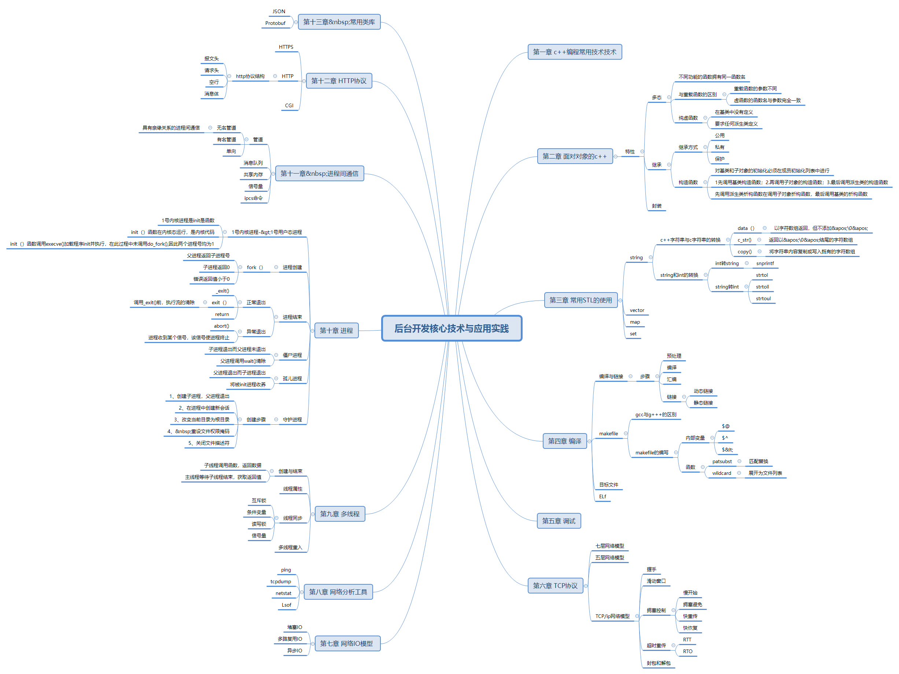

# 后台开发核心技术与应用实践

## 思维导图

## 总结

主要看了2、4、69、10、11、12章

- 第一章介绍c++基础未看
- 第二章看了些面向对象的内容，之前有看过类似内容，但没有完全理解，影响不深，这次对c++的继承、多态有了更多的理解，包括继承方式、虚函数与重载函数的区别，构造和析构函数的调用顺序
- 第3章的stl主要讲了string、vector、map、set，这些内容可以参考c++primer，没有细看
- 第4章 讲编译的内容，重点看了本章，之前有看过编译方面的内容但缺少实践，对里面的内容有些模糊，其中makefile的内容相对关键，对其中的基本语句，内部变量和函数有了一个大概的了解，但还没有尝试自己编写
- 第5章 没细看
- 第6章 关于tcp的内容，比较关键，与计算机网络的内容差不多，之后会阅读《tcp/ip详解》来学习相关知识
- 第7章 io模型 同步、异步、多路复用、堵塞、非堵塞的io方式
- 第8章 网络分析工具，与计算机网络的实验类似，没有一个个去仔细尝试，只是大概的测试了下，之后需要使用的时候在记下这些命令
- 第9章 多线程 介绍线程的一些概念，包括线程属性，同步和重入等
- 第10章 进程 了解了进程的创建步骤，以及linux开机时的一些进程创建顺序，了解孤儿进程、僵尸进程、守护进程的概念，了解进程回收机制
- 第11章 了解进程间的通信，包括通道、消息队列、共享内存、信号量的内容，与操作系统类似
- 第12章 http协议，大概了解了下http协议的结构和工作流程，没有充分理解，之后需要使用的时候可以查看相关专业书籍
- 第13章 粗略看了下json和protobuf的使用

主要来说，这本书讲的内容比较基础概括，没有涉及复杂内容，以介绍开发常用工具与一些基本常用技术为本

