# 第一章 引论

## 本质

- 是计算机硬件的第一层软件
- 是对硬件系统的首次扩充
- 对内是**资源管理者**，对外是**用户接口**

## 目标

- 方便性

   配置os后可使操作系统更容易使用

- 有效性

  1. 提高系统资源利用率
  2. 提高系统的吞吐量

- 可扩充性

    os必须具有很好的可扩充性，方能适应计算机硬件、体系结构以及应用发展的要求

- 开放性

  为使来自**不同厂家**的计算机和设备能够通过网络加以**集成化**，并能正确、有效的**协同工作**，实现应用的**可移植性和互操作性**，要求操作系统必须**提供统一的开放环境**，进而要求os具有开放性。  

## 作用

1. 作为用户与计算机硬件系统之间的接口

   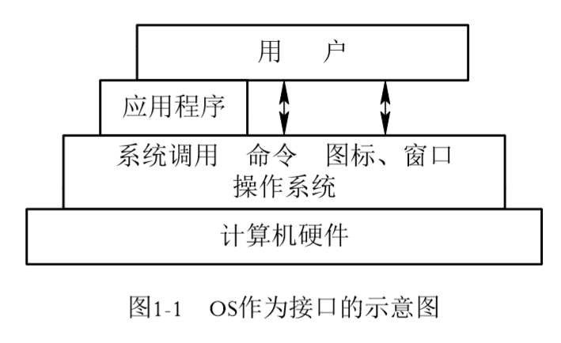

2. 作为计算机系统资源的管理者

    四类计算机资源：处理器、存储器、I/O设备以及信息（数据和程序）

   os的主要功能是针对四类资源进行有效管理：

   - 处理机管理，用于分配和控制处理机
   - 存储器管理，主要负责内存的分配和回收
   - I/O设备管理，负责I/O设备的分配和操纵
   - 文件管理，负责文件的存取、共享和保护

3. 实现了对计算机资源的抽象

## 发展过程

1. 单道批处理系统

   系统对作用的处理是**成批进行**的，且在内存中始终只存在一道作业。

   特征：自动性、顺序性、单道性

2. 多批道处理系统

   - 优缺点：资源利用率高、系统吞吐量大、平均周转时间长、无交互能力

3. 分时系统

   特征：多路性、独立性、及时性、交互性

4. 实时操作系统

5. 微机操作系统 

   单用户单任务操作系统

   单用户多任务操作系统

   多用户多任务操作系统

## 基本特性

1. 并行和并发

   并行：两个或多个事件在**同一刻**发生；

   并发：两个或多个事件在**同一时间间隔**内发生

2. 进程

   概念：在系统中能**独立运行**并作为**资源分配的基本单位**，由一组机器指令、数据和堆栈组成。是一个能独立运行的实体

   通常的程序是静态实体，在多道程序系统中不能独立运行

   引入进程的目的是为了使多个程序能并发运行

3. 共享

   互斥共享方式

   同时访问方式

4. 虚拟

   时分复用技术：虚拟处理机技术/虚拟设备技术

   空分复用技术

5. 异步

## 主要功能

1. 处理机管理功能

   - 进程控制
   - 进程同步
   - 进程通信
   - 调度：作业调度/进程调度

2. 存储器管理功能

   内存分配：静态/动态分配方式

   内存保护

   地址映射

   内存扩充：请求调入功能/置换功能

3. 设备管理功能

   - 缓存管理
   - 设备分配
   - 设备处理

4. 文件管理功能

   - 文件存储空间管理
   - 目录管理
   - 文件的读/写管理保护

5. 操作系统与用户之间的接口

   - 联机用户接口
   - 脱机用户接口
   - 图形用户接口

6. 现代操作系统的新功能

7. - 系统安全
   - 网络的功能和服务
   - 支持多媒体

## 结构设计

1. 传统操作系统结构
   - 无结构操作系统（软件危机）
   - 模块化结构os（高内聚低耦合——横向关联）
   - 分层式结构os（隐马尔可夫链——纵向关联）
2. C/S模式（客户/服务器）
3. 面向对象的程序设计
4. 微内核os结构（优缺点）
   - 足够小的内核
   - C/S模式
   - 应用“机制和策略分离”原理
   - 采用面向对象技术
# 第二章 进程

## 前趋图和程序执行

1. 前趋图是一个**有向无循环图**，记为DAG，用于描述进程之间执行的**前后关系**。

  结点：程序段或进程，乃至一条语句

  有向边：结点之间存在的前趋关系

 初始结点：无前趋的结点

 终止结点：无后继的结点

重量：该结点所含有的程序量或结点的执行时间

==前趋图中不存在循环==

2. 程序顺序执行的特征

- 顺序性：处理机的操作严格按照程序所规定的顺序执行
- 封闭性：程序在封闭环境下执行，即运行时独占全机资源
- 可再现性：只要执行环境和初始条件相同，不论如何执行，都获得相同的结果
3. 程序并发运行

   特征：间断性、失去封闭性、不可再现性

## 进程描述

1. 进程定义：是进程实体的**运行过程**，是系统进行**资源调度**的一个**独立单位**

   进程控制块（pcb）

   - 进程标识符：内部标识符（由操作系统创建）外部标识符（由创建者提供）
   - 处理机状态：主要由处理机的各种寄存器的内容组成（通用寄存器、指令计数器、程序状态字psw、用户栈指针）
   - 进程调度信息：进程状态、进程优先级、其他信息、事件（堵塞原因）
   - 进程控制信息
     - 程序和数据地址
     - 进程同步和通信机制
     - 资源清单
     - 链接指针

   进程实体：由程序段、相关数据段和pcb三部分构成

2. 特征

   - 动态性：**最基本特征**。“由创建而产生，因调度而执行，由撤销而消亡”

   - 并发性：多个进程实体同存于内存中，且在**一段时间**内能独立运行

   - 独立性：在传统os中，独立性是指进程实体是一个能独立运行、独立分配资源和独立接收调度的基本单位

   - 异步性：进程实体按异步方式运行

     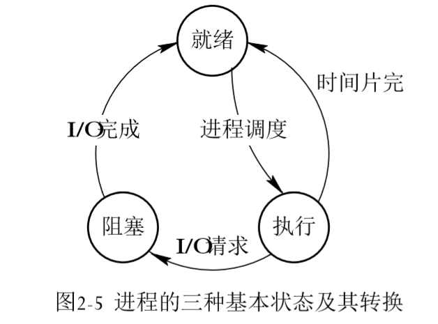

     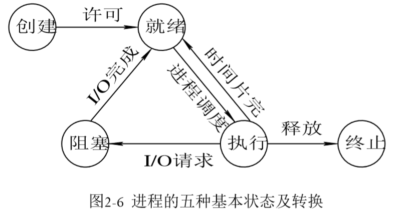

## 进程控制

进程控制是进程管理中**最基本的功能**，用于创建一个新进程，终止一个已完成进程，或终止一个因出现某事件而使其无法运行下去的进程，还可负责进程运行中的状态转换。

1. 操作系统内核

   1. 系统态（管态）、用户态（目态）
   2. 支撑功能：中断管理、时钟管理、原语操作
   3. 资源管理功能：进程、存储器、设备管理

2. 进程创建

   进程图：描述一个进程家族关系的**有向树**

   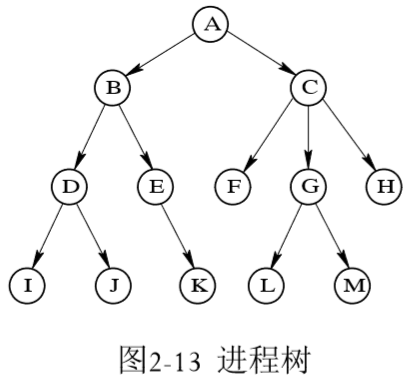

   引起创建进程的事件

   - 用户登录
   - 作业调度
   - 提供服务
   - 应用请求

   引起进程终止的事件

   - 正常结束
   - 异常结束
   - 外界干预

   引起进程堵塞或唤醒事件

   - 请求系统服务
   - 等待操作完成
   - 新数据尚未到达
   - 等待新任务的到达

## 进程同步

1. 基本概念
   1. 制约关系：间接相互制约关系、直接相互制约关系
   2. 临界资源
   3. 临界区
   4. 同步机制规则
      1. 空闲让进
      2. 忙则等待
      3. 有限等待
      4. 让权等待
2. 硬件同步机制
3. 信号量机制
   - 整型信号量
   - 记录型信号量

# 第三章 处理机

## 处理机调度的层次和调度算法的目标

### 层次

1. 高级调度：又称长程调度或作业调度，对象是作业
2. 低级调度：又称进程调度或短程调度，对象是进程
3. 中级调度：又称内存调度

### 目标

1. 处理机调度的共同目标
   - 资源利用率：`CPU利用率=有效工作时间/总时间`
   - 公平性：公平性是相对的
   - 平衡性：保持系统资源使用的平衡性
   - 策略强制执行
2. 批处理系统的目标
   - 平均周转时间短
   - 系统吞吐量高
   - 处理机利用率高
3. 分时系统目标
   - 响应时间快
   - 均衡性
4. 实时系统目标
   - 截止时间的保证
   - 可预测性

## 作业和作业调度

### 批处理系统中的作业

作业运行的三个阶段和三种状态

- 收容状态：建立jcb
- 运行状态：建立pcb
- 完成状态：回收pcb和jcb

### 作业调度的主要任务

### 作业调度算法

1. 先来先服务（FCFS）

2. 短作业优先调度

   FCFS算法有利于长作业，而不利于作业

   SJF：短作业优先调度算法

   SPF：短进程优先调度算法

   缺点：

   - 对长作业不利
   - 完全未考虑作业的紧迫程度
   - 不一定真正做到短作业优先调度

3. 优先级调度算法（FPF）

   1. 优先权调度算法类型
      - 非抢占式优先
      - 抢占式优先
   2. 优先权类型：静态优先权、动态优先权

4. 高响应比优先调度算法

## 进程调度

### 进程调度任务

1. 保存处理机的现场信息
2. 按某种算法选取进程
3. 把处理器分配给进程

### 进程调度机制

1. 排队器
2. 分派器
3. 上下文切换器

### 调度方式

- 非抢占方式：突发事件、I/O请求、进程通信
- 抢占方式：优先权原则、短进程优先原则、时间片原则

### 轮转调度算法

### 多机反馈队列算法

## 死锁概述

### 资源问题和死锁原因

- 竞争资源：可重用性资源和消耗性资源、可抢占性资源和不可抢占性资源
- 进程间推进顺序非法：请求和释放资源顺序不当

1. 竞争不可抢占性资源引起资源死锁
2. 竞争可消耗性资源引起死锁
3. 进程推进顺序不当引起死锁

### 死锁的定义、必要条件和处理方法

1. 定义
2. 必要条件
   - 互斥条件
   - 请求和保持条件
   - 不剥夺条件
   - 环路等待条件
3. 处理死锁方法
   - 预防死锁：通过设置某些限制条件，破坏产生死锁的四个必要条件中的一个或多个，来预防死锁
   - 避免死锁：在资源动态分配过程中，用某种方法去防止系统进入不安全状态
   - 检测死锁：通过系统所设置的检测机构及时检测出死锁的发生，并精确地确定与死锁有关的进程和资源，然后采取适当的措施，从系统中清除已发生的死锁
   - 解除死锁：与检测死锁向配套的一种措施

## 预防死锁

1. 摒弃“请求和保持”条件：所有进程开始前都必须一次性申请其在整个运行过程中所需的全部资源
2. 破坏“不可抢占”条件：进程逐个提出对资源的请求。当进程提出新的资源请求而得不到满足时，释放其已保持的所有资源，待以后需要时重新申请。
3. 破坏“环路等待”条件：所有资源按线性排队，所有进程对资源的请求必须严格按照资源序号递增的次序提出

##　避免死锁

1. 允许进程动态申请资源，但系统在进行资源分配前，先计算资源分配的安全性，如此次分配导致系统进入不安全状态，则令进程等待。
   - 安全状态：系统能够按某种进程顺序来为每个进程分配其所需资源，直至满足每个进程对资源的最大需求。使每个进程可以顺利完成。
   - 并非所有不安全状态都必然会转为死锁状态，但当系统进入不安全状态时，便有可能进入死锁状态。
2. 银行家算法
3. 安全性算法

##　 死锁的检测和解除

1. 死锁的检测
   - 保存有关资源的请求和分配信息
   - 提供一种算法，以利用这些信息来检测系统是否已经进入死锁状态
   - 死锁定理：当且仅当s状态的**资源分配图**是不可完全简化的（充分条件）
2. 死锁的解除
   - 剥夺资源：从**其他进程**剥夺足够数量的资源给死锁进程，以解除死锁
   - 撤销进程

# 第四章  存储器

## 存储器的层次结构

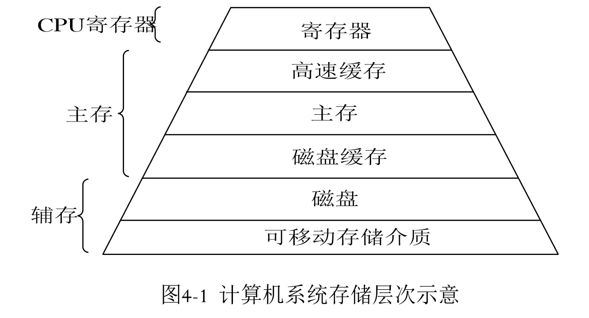

## 程序的装入与链接

- 编译：由编译程序将用户源代码编译成若干个目标模块
- 链接：由链接程序将编译后形成的一组目标模块，以及它们所需的库函数链接在一起，形成一个完整的装入模块
- 装入：由装入程序将装入模块装入内存

1. 程序的装入方式
   - 绝对装入方式
   - 可重定位装入方式
   - 动态运行时装入方式
2. 程序的链接
   - 静态链接：程序运行前
   - 装入时动态链接：装入内存时
   - 运行时动态链接：程序执行需要该模块时

## 连续分配存储管理方式

1. 单一连续分配
2. 固定分区分配 
   - 分区方法：分区大小相等、分区大小不等
   - 内存分配
3. 动态分区分配
4. 动态可重定位分区分配

## 对换Swapping

 将内存中暂时不能运行的进程或者暂时不用的程序和数据调出到外存上，以腾出足够的内存空间，再将已具备运行条件的进程或进程所需的程序和数据调入内存

## 分页存储管理方式

- 分页存储管理：逻辑页大小=物理块大小
- 分段存储管理：逻辑性强，物理性若
- 段页式存储管理：段中有页

1. 基本方法
   - 页面：将一个进程的逻辑地址空间分成若干大小相等的片
   - 物理块/页框：把内存空间分成与页面大小相等的若干个存储块 
2. 地址变换机构
   - 基本的地址变换机构
   - 具有块表的地址变换机构
3. 两级和多级页表

## 分段存储管理方式

# 第五章虚拟存储器

## 概述

### 常规存储器管理方式特征

1. 一次性
2. 驻留性

### 局部性原理

1. 程序执行时，除了少部分的转移和过程调用指令外，在大多数情况下仍是顺序执行的
2. 过程调用将会使程序的执行轨迹由一部分区域转至另一部分区域，但过程调用的深度大多数情况下不超过5，即程序在一段时间内都局限在这些过程内执行
3. 程序中存在许多循环结构
4. 程序包括许多对数据结构的处理
   - 局部性还表现在**时间局限性**和**空间局限性**

### 虚拟存储器的定义和特征

- 虚拟存储器是指具有**请求**和**置换**功能，能从**逻辑**上对内存容量加以扩充的一种存储系统
- 其逻辑容量由内存容量和外存容量之和决定，运行速度接近于内存速度，而每位的成本接近于外存
- 特征
  1. 多次性：指一个作业被分成多次调入内存
  2. 对换性：允许在作业的运行过程中进行换进、换出
  3. 虚拟性：从逻辑上扩充内容容量

## 请求分页管理方式

### 硬件支持

1. 请求分页的页表机制

2. 缺页中断机构

3. 地址变换机构

   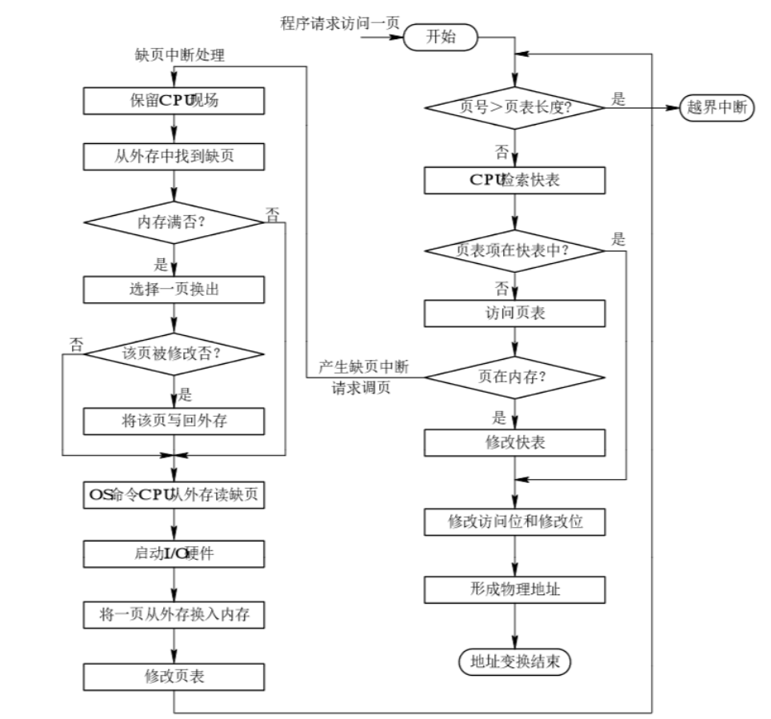

### 实现请求分页的软件

- 实现**请求调页**的软件和实现**页面置换**的软件
- 最小物理块数：保证进程正常运行所需的最小物理块数，少于此值时，进程将无法运行

1. 物理块分配策略
   - 固定分配局部置换
   - 可变分配全局置换
   - 可变分配局部置换
2. 物理块分配算法
   - 平均分配算法
   - 按比例分配算法
   - 考虑优先权的分配算法
3. 调页策略
   - 预调页策略
   - 请求调页策略

## 页面置换算法

1. 最佳置换算法
2. 先进先出置换算法
3. 最近最久未使用算法（LRU）

##  “抖动”与工作集

## 请求分段存储管理方式

### 硬件支持

1. 请求分段的段表机制

2. 缺段中断机构

   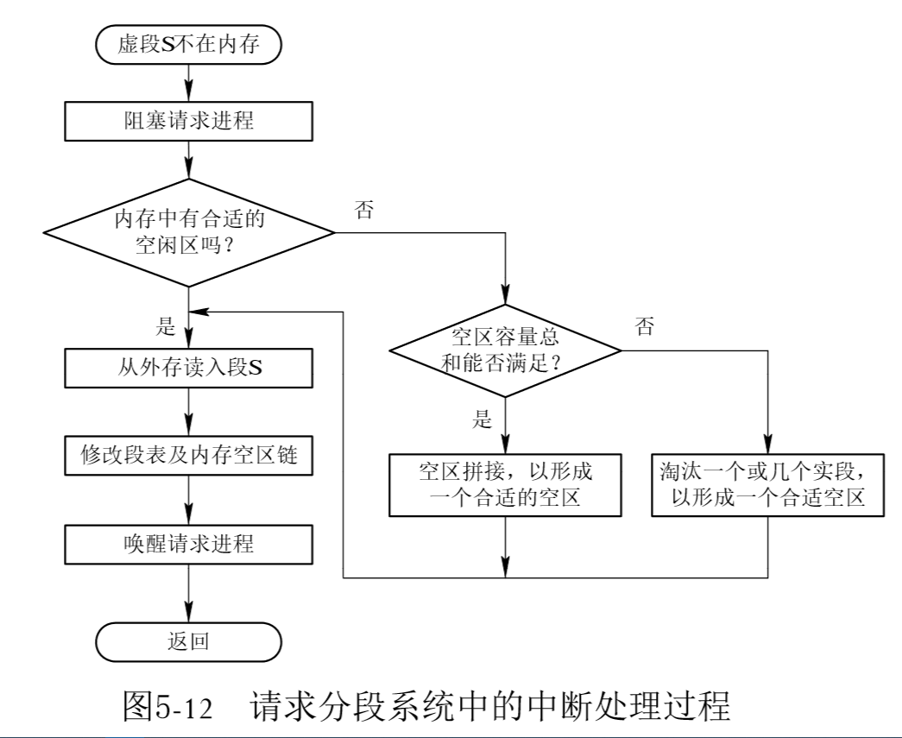

3. 地址变换机构

#  第六章 输入输出

## I/O系统的功能、模型和接口

- 管理的主要对象是**I/O设备和相应的设备控制器**
- 最主要的任务是：
  - 完成用户提出的I/O请求
  - 提高I/O速率
  - 提高设备的利用率
  - 为更高层的进程方便地使用这些设备提供手段

### 基本功能

1. 隐藏物理设备的细节
2. 与设备无关性
3. 提高处理机和I/O设备的利用率
4. 对I/O设备进行控制
5. 确保对设备的正常共享
6. 错误处理 

### 层次结构模型

1. 层次结构

   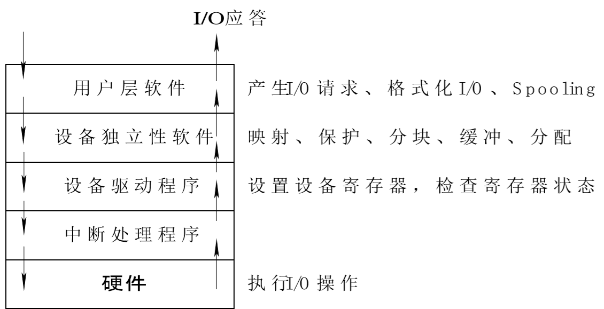

## I/O设备和设备控制器

1. I/O 设备的类型

   - 按使用特性：存储设备 输出输出设备
   - 按传输速率：低俗设备；中速设备；高速设备
   - 按信息交换单元：块设备；字符设备
   - 按共享属性：独占设备；共享设备；虚拟设备

2. 设备与控制器之间的接口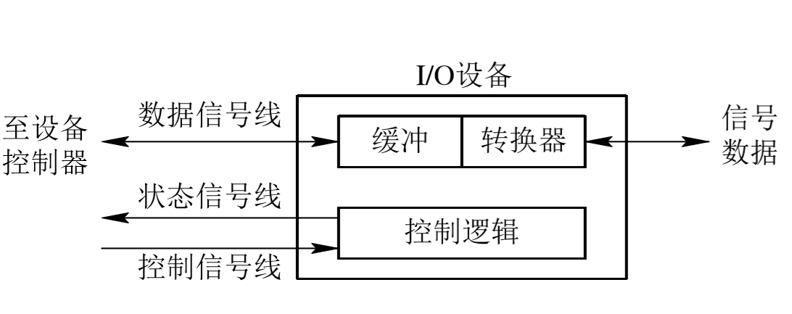

3. 设备控制器的基本功能

   - 接收和识别命令
   - 数据交换
   - 标识和报告设备的状态
   - 地址识别
   - 数据缓存区
   - 差错处理

4. 设备控制器的组成

   - 设备控制器与处理器的接口

   - 设备控制器与设备的接口

   - I/O逻辑

     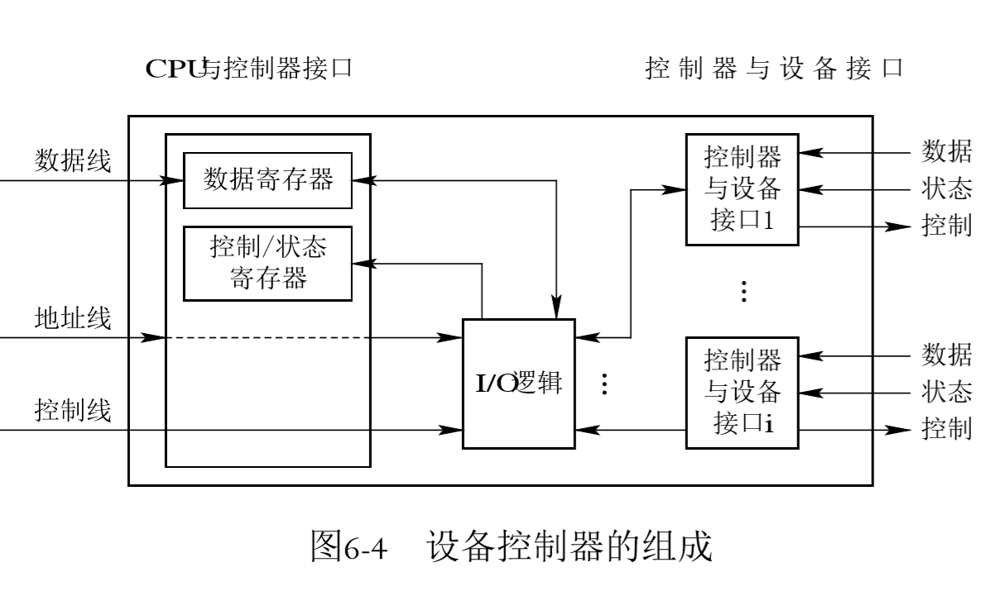

5. I/O通道

   - 字节多路通道
   - 数组选择通道
   - 数组多路通道

   

## 中断机构和中断处理程序

### I/O控制方式

1. 程序I/O方式
2. 中断驱动I/O控制方式
3. 直接存储器访问I/O控制方式（DMA）
4. I/O通道控制方式

## 设备驱动程序

- 设备驱动程序，又称设备处理程序，是I/O进程与设备控制器之间的通信程序
- 主要任务是接收上层软件发来的抽象I/O请求，将其转化为具体要求后发给设备控制器

### 设备驱动程序的功能

1. 接收由设备独立性软件发来的命令和参数，并将命令中的抽象要求转化为具体要求
2. 检查用户I/O请求的合法性，了解I/O设备的状态，传递有关参数，设置设备的工作方式
3. 发出I/O命令。如设备空闲，便立即启动I/O设备去完成指定的I/O操作；如设备忙碌，则将请求者的请求挂在设备队列上等待
4. 及时响应由控制器或通道发来的中断请求，并根据器中断类型调用相应的中断处理程序进行处理
5. 对于设置有通道的计算机系统，驱动程序还应根据用户的I/O请求，自动地构成通道程序

### 设备处理方式

1. 为每一类设备设置一个进程，专门用于执行这类设备的I/O操作
2. 在整个系统中设置一个I/O进程，专门用于执行系统中所有各类设备的I/O操作
3. 不设置专门的设备处理进程，而只为各类设备设置相应的设备处理程序，供用户进程或系统进程调用

### 设备驱动程序的特点

1. 设备驱动程序主要是指在请求I/O的进程与设备控制器之间的一个转换程序。
2. 驱动程序与设备控制器和I/O设备的硬件特性紧密相关，因而对不同类型的设备应配置不同的驱动程序
3. 驱动程序与I/O设备所采用的I/O控制方式紧密相关，
4. 由于驱动程序与硬件紧密相关，因而其中的一部分必须用汇编语言书写
5. 驱动程序应允许重入

### 设备驱动程序的处理过程

1. 将抽象要求转化为具体要求
2. 检查I/O 设备的合法性
3. 读出和检查设备的状态
4. 传送必要的参数
5. 工作方式的设置
6. 启动I/O设备

## 与设备无关的I/O软件

### 基本概念

1. 以物理设备名使用设备
2. 引入了逻辑设备名
3. 逻辑设备名称到物理设备名称的转换

##用户层的I/O软件

### Spooling（假脱机）

spooling的组成

1. 输入井和输出井
2. 输入缓冲区和输出缓冲区
3. 输入进程和输出进程
4. 井管理程序

spooling的特点：

- 提高了I/O的速度
- 将独占设备改造成共享设备
- 实现了虚拟设备功能 

## 缓存区管理

### 引入缓存区的原因

- 缓和CPU和I/O设备间速度不匹配的矛盾
- 减少对CPU的中断频率，放宽对CPU中断响应的限制
- 解决数据粒度不匹配的问题
- 提高CPU和I/O设备之间的并行性

### 缓存池

组成

- 空白缓冲队列
- 输入队列
- 输出队列
- 工作缓冲区：用于收容输入数据的工作缓冲区，用于提取输入数据的工作缓冲区、用于收容输出数据的工作缓冲区、用于提取输出数据的工作缓冲区

工作方式

- 收容输入
- 提取输入
- 收容输出
- 提取输出

## 磁盘存储器的性能和调度

### 磁盘访问时间

1. 寻道时间
2. 旋转延迟时间
3. 传输时间

### 早期磁盘调度算法

1. 先来先服务（FCFS）
2. 最短寻道时间优先（SSTF）

### 基于扫描的磁盘调度算法

1. 扫描算法（SCAN）
2. 循环扫描算法（CSCAN）
3. NStepSCAN算法
4. FSCAN算法

# 第七章 文件管理

## 数据组成

1. 数据项
   - 数据项是最低级的数据组织形式
   - 可分为：基本数据项和组合数据项
2. 记录
   - 一组相关数据项的集合，用于描述对象在某些方面的属性
   - **关键字**：唯一能标识一个记录的数据项
3. 文件
   - 由创建者所定义的、具有文件名的一组相关元素的集合，可分为有结构文件和无结构文件
   - 文件是文件系统中一个最大的数据单位
   - 文件属性包括：文件类型、文件的物理位置、文件长度、文件的建立时间

### 文件类型

1. 按用途分类
   - 系统文件
   - 用户文件
   - 库文件
2. 按文件中数据的形式分类
   - 源文件
   - 目标文件
   - 可执行文件
3. 按存取控制属性分类
   - 只执行文件
   - 只读文件
   - 读写文件
4. 按组织形式和处理方式分类
   - 普通文件
   - 目录文件
   - 特殊文件

### 层次结构

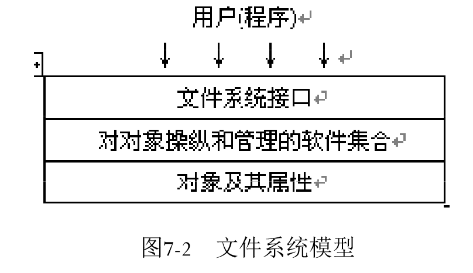

1. 对象及其属性：文件、目录、磁盘  
2. 对对象操纵和管理的软件集合：
   - 对文件存储空间的管理
   - 对文件目录的管理
   - 用于将文件的逻辑地址转换为物理地址的机制
   - 对文件读和写的管理
   - 对文件的共享和保护
   - 将与文件系统相关的软件分为四个层次：I/O控制层、基本文件系统层、基本I/O管理程序、逻辑文件系统
3. 文件系统接口
   - 命令接口
   - 程序接口

### 文件操作

1. 最基本文件操作
   - 创建文件
   - 删除文件
   - 写文件
   - 设置文件的读写位置

## 文件的逻辑结构

### 文件的类型

1. 按文件是否有结构分类
   - 有结构文件：定长记录、变长记录
   - 无结构文件
2. 按文件的组织方式分类
   - 顺序文件
   - 索引文件
   - 索引顺序文件

## 文件目录

### 文件控制块（FCB）

1. 基本信息：文件名，文件物理位置，文件逻辑结构，文件的物理结构
2. 存储控制信息：文件主的存取权限，核准用户的存取权限，一般用户的存取权限
3. 使用信息

### 简单文件目录

1. 单级文件目录
2. 两级文件目录

### 树形结构目录

1. 树形目录
2. 路径名和当前目录

## 文件共享

1. 基于有向无循环图实现文件共享
2. 利用符号链接来实现文件共享

## 文件保护

1. 保护域
2. 访问矩阵8

# 第八章 磁盘存储器的管理

  

