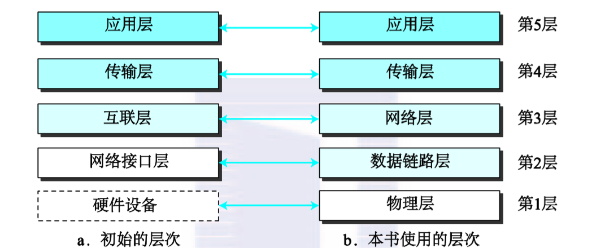
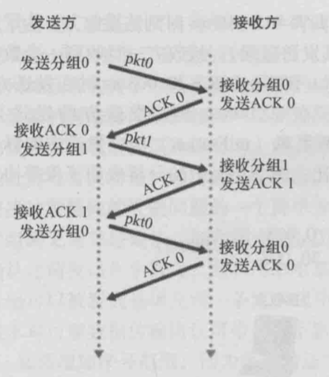
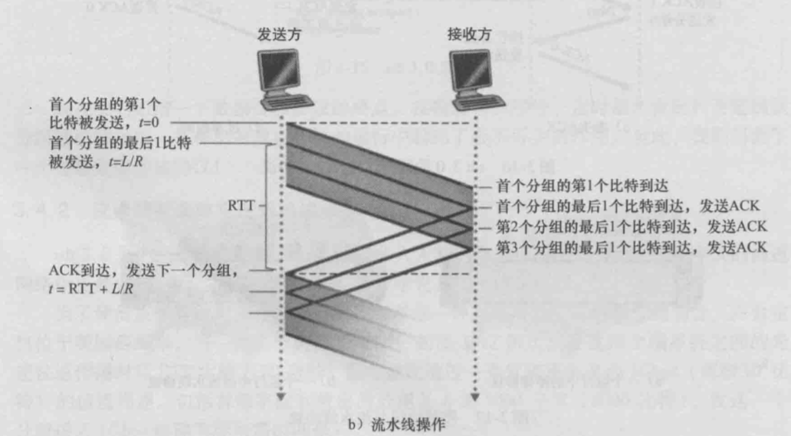
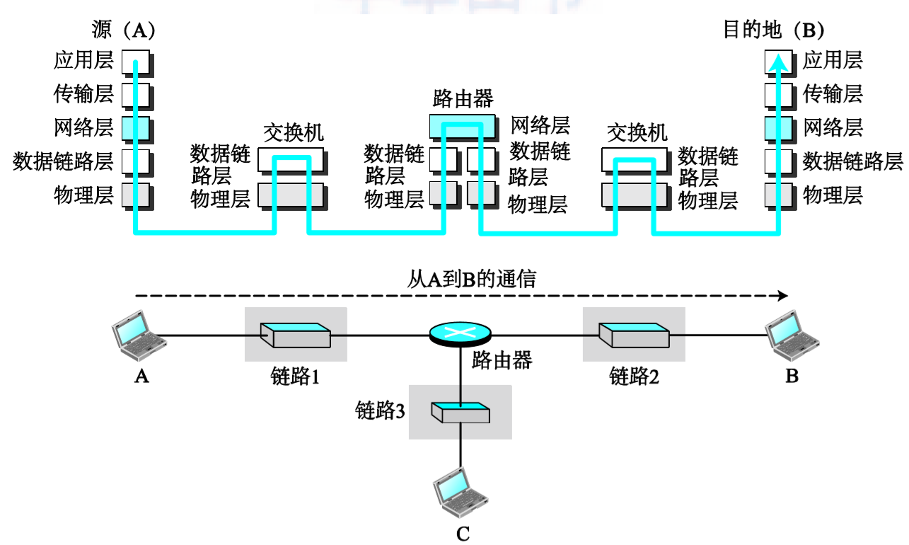
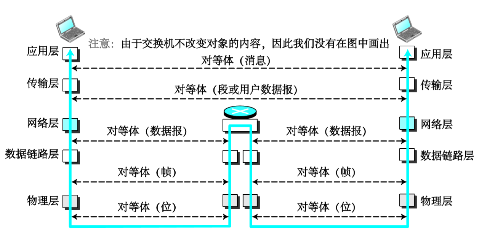

# 计算机网络学习笔记

## 网络

### 局域网和广域网的区别

广域网（wide area network，WAN）也是由具有通信能力的设备相互连接而形成的。可是，局域网和广域网有一些不同。局域网通常覆盖范围受限，可以覆盖一间办公室、一栋大楼或一个校园；广域网则具有更广的地理覆盖范围，可以覆盖一个城市、一个省、一个国家甚至整个世界。局域网互联主机；广域网互联交换机、路由器、调制解调器等连接设备。局域网通常由使用它的组织拥有；广域网通常由通信公司建设和运营，使用它的组织进行租用。我们看看目前使用的两种典型的广域网：点到点广域网和交换式广域网。 	

### 网络层次结构

## 应用层

俩个应用层之间的逻辑连接是**端到端**的，其通信处于两个进程之间。应用层交换的数据成为消息（message）

其常见的协议有http，ssh，smtp，ftp等

## 传输层

两个传输层的逻辑连接也是端到端的。其常见协议有tcp，udp，sctp。TCP中的数据称为段（segment），UDP中的数据称为用户报文（user datagram)

TCP是面向连接的协议，，其提供流量控制、差错控制、拥塞控制

UDP是无连接协议，其尽最大努力交付数据，但不保证对端一定接收到完整数据。	

### 可靠传输

TCP的可靠数据传输形式如下所示，发送端按序发送数据分组，接收方接受到一个数据分组后发送一个ACK确认，接受方收到ACK后才开始发送下一个数据分组。

发送方在规定时间内未收到ACK时，会重发当前数据分组。在此过程中数据分组和ACK均可能在传输过程中丢失，丢失数据分组会导致接收方无法收到数据分组而不发送ACK，丢失ACK会导致发送方无法收到ACK，两者中的任意一者丢失都会导致发送方无法接收到ACK。此外，由于网络影响，ACK可能会延时到达，甚至在发送端超时重发后到达，对于延时到达的重复的数据分组和ACK，发送方和接收方均不在做出反应。

接收方会对接收到的数据分组进行差错检验，若检验出错，接收方不发送ACK，等待发送方超时重传。

上述形式会导致发送方和接收方花费大量时间等待对方应答，对带宽利用率低，因此，实际使用时采用流水线的方式对数据进行传输。

在上图中，发送方一次发送多个数据分组，接受方同时接收多个数据分组并针对每个数据分组发送ACK，当发送方收到所有ACK后，开始发送下一批数据分组。为了解决丢包问题，流水线采用回退N步和选择重传的方式。

回退N步：接收方按序接收数据分组，若接收到一个失序分组（即此分组前存在未接收到的分组）则丢弃分组，同时接收方只为按序分组发送ACK，若发送方收到某分组的ACK而未收到下一个分组的ACK，则认为此数据分组之前的数据全部传输成功，此分组之后的数据全部丢失，发送方开始重传之后的数据。

选择重传：接收方能够接收失序数据分组，且为每个数据分组发送ACK，接收方只重传为收到ACK的数据分组而不重传其之后的数据分组。

### 拥塞控制和流量控制

流量控制是针对接收方的接收能力的，当接收方无法及时处理发送方发送的大量数据从而导致数据丢失时，发送方会根据流量控制减少数据发送量。流量控制主要靠接收窗口实现，接收方通过接收窗口告知发送方接收能力。

拥塞控制是针对网络传输能力的，当网络繁忙时，发送的数据可能出现大量的丢包或延时，这时发送方会控制数据发送量以减轻网络负担。TCP采用拥塞窗口来解决拥塞问题，拥塞窗口会限制 数据发送速率。TCP采用的拥塞控制算法包括慢启动，拥塞避免，快恢复

慢启动，传输开始时，发送方会以大小为1的拥塞窗口开始，并以指数级增加拥塞窗口大小，直至发现网络拥塞达到某一程度时，结束指数增长，转为拥塞避免。

拥塞避免：以较平缓的方法增加拥塞窗口，当丢包率达到某种程度时，将拥塞窗口减半，并启动快恢复

快恢复：拥塞窗口不再从1开始，但执行与慢启动和拥塞避免中相同的操作

## 网络层

网络层的通信时主机到主机的。其主要的协议时IP协议，IP协议是无连接协议，不提供流量控制和差错控制。网络中的数据称为数据报（datagram）

网络层还包括ICMP、IGMP、DHCP、ARP等辅助协议帮助完成 IP转发和路由工作。

## 数据链路层

数据链路层中的数据单元称为帧。

## 交换机、网桥与路由器

**网桥（Bridge)**也称为桥接器，是连接两个局域网的存储转发设备，用它可以使完全具有相同或相似体系结构网络系统的连接，这样不但能扩展网络的距离或范围，而且可提高网络的性能、可靠性和安全性。网桥工作在OSI参考模型的数据链路层（第二层），将两个LAN连起来，根据MAC地址来转发帧，可以看作一个“低层的路由器”（路由器工作在网络层，根据网络地址如IP地址进行转发）。

**交换机**位于链路层，其自身对子网中的主机和路由器时透明的，交换机实质是一个多接口的网桥。交换机具有并行性，能够同时连通多对接口，使多台主机同时通信且彼此之间独占传输媒体，无碰撞发生，而网桥只能一次分析和转发一个帧。

在数据传输过程中，交换机在数据链路层上对数据进行转发，通过识别目标主体的MAC地址决定将数据传输到哪个链路上 ；路由器在网络层对数据进行转发，也就是说路由器在转发过程中会识别传输数据的IP地址，并在链路层将IP地址转化为MAC地址传递给一个数据接收主体。对于路由器和交换机来说，其最终都是通过mac来唯一区分一个主体的，但在路由器中，会将mac地址映射为在该局域网内唯一的ip地址，作为设备的标记。

上述过程中，交换机不会改变数据的内容，但路由器可能会修改网络层以下的的数据内容，比如将数据分组切片。路由器不能修改网络层以上的数据内容，也就是说，对于两台主机而言，无论中间经过多少路由器，其接收端从网络层获取的数据一定与发送端传输到网络层的数据一致。

